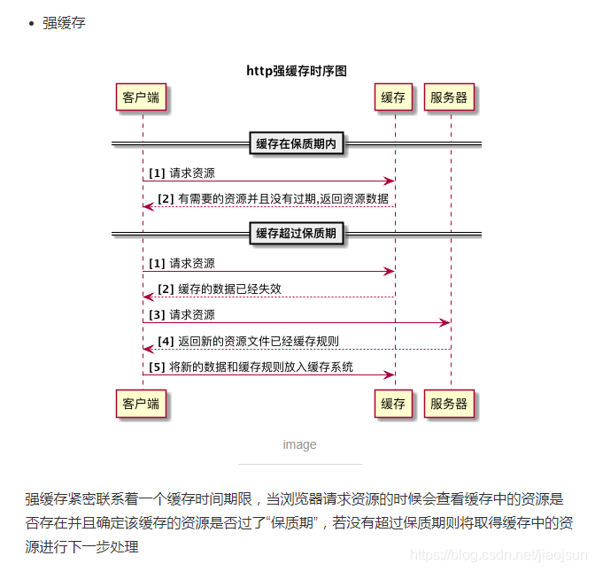
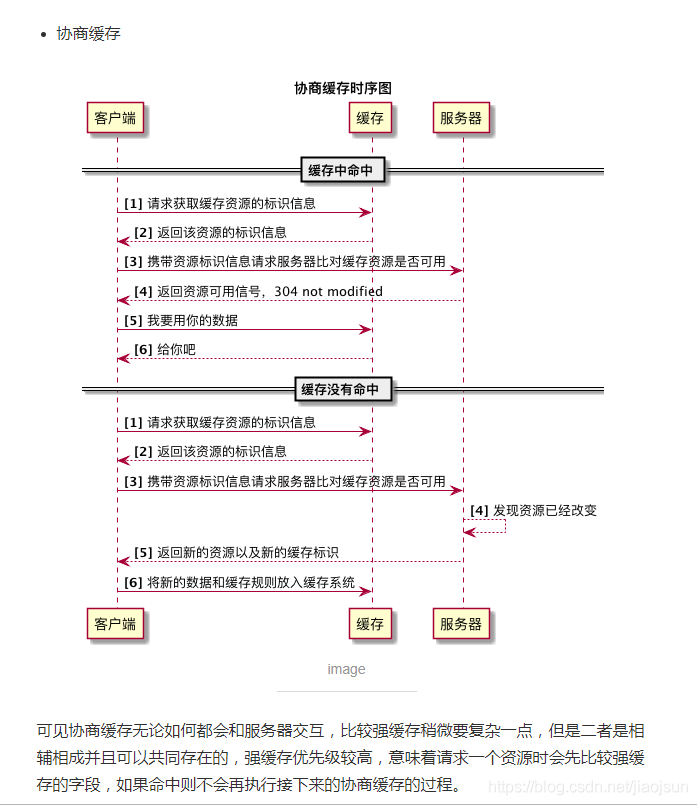

[《现代javascript教程》](https://zh.javascript.info/getting-started)笔记

### 基础知识

#### script

- 嵌入脚本：直接通过script标签嵌入html文档
- 外部脚本：通过src特性指定路径添加到html，指定src特性的script标签，其内容将被忽略。

只有最简单的脚本才嵌入到 HTML 中，更复杂的脚本存放在单独的文件中，使用独立文件的好处是浏览器会下载它，然后将它保存到浏览器的缓存中。之后，其他页面想要相同的脚本就会从缓存中获取，而不是下载它。所以文件实际上只会下载一次。这可以节省流量，并使得页面（加载）更快。

#### 现代模式

- "use strict"启用严格模式（必须出现在脚本的最顶部）
- 高级语言结构会自动开启严格模式

#### 变量

- let：现代变量声明方式
- var：旧变量声明方式
- const：常量声明方式，基本类型值无法修改

#### 数据类型

- number 用于任何类型的数字：整数或浮点数，在 ±(253-1) 范围内的整数。
- bigint 用于任意长度的整数。
- string 用于字符串：一个字符串可以包含 0 个或多个字符，所以没有单独的单字符类型。
- boolean 用于 true 和 false。
- null 用于未知的值，只有一个null值的独立类型（typeof object这是 JavaScript 编程语言的一个错误，实际上它并不是一个 object）。
- undefined 用于未定义的值，只有一个 undefined 值的独立类型(typeof undefined)。
- symbol 用于唯一的标识符。
- object 用于更复杂的数据结构。
- 两种形式：typeof x 或者 typeof(x)，以字符串的形式返回类型名称，例如 "string"。

#### 交互

- alert(text)： modal对话框
- prompt(title, [default]): 文本消息、input、确定、取消，返回输入
- confirm(question): 确定、取消，返回boolean

#### 类型转换

- 字符串转换：String()
- 数字型转换：Number()；算数函数和表达式会自动进行数字类型转换(+优先作为字符串拼接)；undefined(NaN), null(0)；
- 布尔型转换：0、''、null、undefined、NaN变为false；Boolean(0)//false, Boolean('0')//true

#### 操作符

- 基础运算符：
  - 一元操作符：数字转化，一元运算符+(对数字无效，将其他类型转为数字)
  - 赋值运算符：语句 x = value 将值 value 写入 x 然后返回 x（注意是赋值而不是声明）。
  - 原地修改：+=，*=...
  - 自增/自减：++x返回新值，x++返回原值

- 位运算：
  - &: 清零、取指定位、判断奇偶
  - |: 将某些位设为1、
  - ^: 翻转指定位、与0相异或值不变、交换两个数
  - ~: 最低位归零(a&~1)
  - <<, 
  - \>>
  - \>>>无符号右移

- 运算符优先级：一元运算符>二元运算符>三元运算符
- 逗号运算符：运行每个语句，但只返回最后一个（逗号运算符的优先级低于赋值运算符）
- 自增/自减: 前置形式返回新值(a=++i)，后置形式返回原值(a=i++)
- 逻辑运算：
  - ||: 寻找第一个真值、短路求值
  - &&: 寻找第一个假值
  - !: 非运算符 ! 的优先级在所有逻辑运算符里面最高，所以它总是在 && 和 || 之前执行。
- 空值合并运算符：
  - 为可能是未定义的变量提供一个默认值或从一系列的值中选择出第一个非 null/undefined 的值；
  - ??优先级为5，在=和?之间；
  - ??不能与&&/||一起使用，除非使用括号明确指定了优先级

```javascript
a ?? b;
(a !== null && a !== undefined) ? a : b;
```

#### 值比较

- 比较结果为Boolean类型
- 字符串是按字符（母）逐个进行比较的。
- 当对不同类型的值进行比较时，JavaScript 会首先将其转化为数字（number）再判定大小。
- 严格相等运算符 === 在进行比较时不会做任何的类型转换。
- null&undefined

```javascript
// undefined 和 null 在相等性检查 == 中不会进行任何的类型转换，它们有自己独立的比较规则，所以除了它们之间互等外，不会等于任何其他的值
alert( null === undefined ); // false
alert( null == undefined ); // true
alert( null > 0 );  // (1) false
alert( null == 0 ); // (2) false
alert( null >= 0 ); // (3) true
// undefined 不应该被与其他值进行比较
// undefined 只与 null 相等
alert( undefined > 0 ); // false (1)
alert( undefined < 0 ); // false (2)
alert( undefined == 0 ); // false (3)
```

#### 条件分支

- if语句会计算括号内表达式并转换为布尔形式
- condition ? value1 : value2
- 有时可以使用问号 ? 来代替 if 语句

#### 循环

- while(...){...}
- do{...}while(...)
- for(begin; condition; step){...}
- break/continue支持标签，可以一次从多层循环中跳出

```js
outer: for (let i = 0; i < 3; i++) {

  for (let j = 0; j < 3; j++) {

    let input = prompt(`Value at coords (${i},${j})`, '');

    // 如果是空字符串或被取消，则中断并跳出这两个循环。
    if (!input) break outer; // (*)

    // 用得到的值做些事……
  }
}
alert('Done!');
```

#### switch

- switch：
  - 至少含有一个case和一个可选的default；
  - 如果没有 break，程序将不经过任何检查就会继续执行下一个 case；
  - 共享同一段代码的几个 case 分支可以被分为一组
  - case的判断条件使用严格相等

```js
switch(x) {
  case 'value1':  // if (x === 'value1')
    ...
    [break]

  case 'value2':  // if (x === 'value2')
    ...
    [break]

  default:
    ...
    [break]
}
```

#### 函数

- 声明(在主代码流中声明为单独的语句的函数)和表达式(在一个表达式中或另一个语法结构中创建的函数)
  - 函数表达式是在代码执行到达时被创建，并且仅从那一刻起可用
  - 在函数声明被定义之前，它就可以被调用,一个全局函数声明对整个脚本来说都是可见的，无论它被写在这个脚本的哪个位置
  - 严格模式下，当一个函数声明在一个代码块内时，它在该代码块内的任何位置都是可见的。但在代码块外不可见。

```js
// 函数声明
function sayHi() {
  alert( "Hello" );
}

// 函数表达式
let sayHi = function() {
  alert( "Hello" );
};
```

### 对象

#### 基本语法

```js
let user = new Object(); // “构造函数” 的语法
let user = {};  // “字面量” 的语法

// 对象的key
user.isAdmin = true;
user["likes birds"] = true;
delete user.isAdmin;
delete user["likes birds"];

// 计算属性
let fruit = 'apple';
let bag = {
  [fruit + 'Computers']: 5 // bag.appleComputers = 5
};

// 属性值缩写
function makeUser(name, age) {
  return {
    name, // 与 name: name 相同
    age,  // 与 age: age 相同
    // ...
  };
}

// 属性存在性测试
"key" in object

// 如果遍历一个对象，整数属性会被进行排序，其他属性则按照创建的顺序显示
let codes = {
  "49": "Germany",
  "41": "Switzerland",
  "44": "Great Britain",
  // ..,
  "1": "USA"
};

for(let code in codes) {
  alert(code); // 1, 41, 44, 49
}
let codes = {
  "+49": "Germany",
  "+41": "Switzerland",
  "+44": "Great Britain",
  // ..,
  "+1": "USA"
};

for (let code in codes) {
  alert( +code ); // 49, 41, 44, 1
}
```

#### 引用和复制

与原始类型相比，对象的根本区别之一是对象是“通过引用”被存储和复制的，与原始类型值相反：字符串，数字，布尔值等 —— 始终是以“整体值”的形式被复制的。因此仅当两个对象所指向的地址相同时，二者才相等：
```js
let a = {};
let b = a; // 复制引用

alert( a == b ); // true，都引用同一对象
alert( a === b ); // true

let a = {};
let b = {}; // 两个独立的对象

alert( a == b ); // false
```

Object.assign方法用于合并对象，该方法将所有原对象的属性拷贝到目标对象并返回目标对象，相同的属性名之间会进行覆盖。

深拷贝
```js
function DeepCopy(src){
  if ((typeof src != 'object'){
    return src;
  }
  const dest = src instanceof Array ? []: {};
  for(var item in src) {
    dest[item] = DeepCopy(src[item]);
  }
  return dest;
}
```

```js
Object.assign(dest, [src1, src2...])
```

#### 垃圾回收

JavaScript 中主要的内存管理概念是可达性，“可达”值是那些以某种方式可访问或可用的值，它们一定是存储在内存中的，例如当前函数的局部变量和参数、嵌套调用时调用链上所有的函数变量与参数以及全局变量等。如果一个值可以通过引用或引用链从根访问任何其他值，则认为该值是可达的。

垃圾回收的基本算法被称为 “mark-and-sweep”，定期执行以下“垃圾回收”步骤：

- 垃圾收集器找到所有的根，并“标记”（记住）它们。
- 然后它遍历并“标记”来自它们的所有引用。
- 然后它遍历标记的对象并标记它们的引用。所有被遍历到的对象都会被记住，以免将来再次遍历到同一个对象，如此操作，直到所有可达的（从根部）引用都被访问到。
- 没有被标记的对象都会被删除。

优化建议：

- 分代收集（Generational collection）—— 对象被分成两组：“新的”和“旧的”。许多对象出现，完成它们的工作并很快死去，它们可以很快被清理。那些长期存活的对象会变得“老旧”，而且被检查的频次也会减少。
- 增量收集（Incremental collection）—— 如果有许多对象，并且我们试图一次遍历并标记整个对象集，则可能需要一些时间，并在执行过程中带来明显的延迟。所以引擎试图将垃圾收集工作分成几部分来做。然后将这几部分会逐一进行处理。这需要它们之间有额外的标记来追踪变化，但是这样会有许多微小的延迟而不是一个大的延迟。
- 闲时收集（Idle-time collection）—— 垃圾收集器只会在 CPU 空闲时尝试运行，以减少可能对代码执行的影响。

#### 构造函数

构造函数在技术上是常规函数。不过有两个约定：

- 它们的命名以大写字母开头
- 它们只能由 "new" 操作符来执行。

当一个函数被使用 new 操作符执行时，它按照以下步骤：

- 一个新的空对象被创建并分配给 this
- 函数体执行。通常它会修改 this，为其添加新的属性
- 返回 this 的值。

```js
function User(name) {
  // this = {};（隐式创建）

  // 添加属性到 this
  this.name = name;
  this.isAdmin = false;

  // return this;（隐式返回）
}
```

new function() { … }构造器不能被再次调用，因为它不保存在任何地方，只是被创建和调用。因此，这个技巧旨在封装构建单个对象的代码，而无需将来重用。

new.target用于检查函数是否被作为构造函数调用，是则返回函数本身，否则返回undefined。

通常，构造器没有 return 语句。它们的任务是将所有必要的东西写入 this，并自动转换为结果。但是，如果这有一个 return 语句：

- 如果 return 返回的是一个对象，则返回这个对象，而不是 this。
- 如果 return 返回的是一个原始类型，则忽略。

#### 可选链

- obj?.prop —— 如果 obj 存在则返回 obj.prop，否则返回 undefined。
- obj?.[prop] —— 如果 obj 存在则返回 obj[prop]，否则返回 undefined。
- obj.method?.() —— 如果 obj.method 存在则调用 obj.method()，否则返回 undefined。
- ?.前的变量必须已声明

- 属性、访问器getter/setter
- new， delete
- toString, valueOf

#### Symbol

- 对象属性只能是String或Symbol
- Symbol通过实例化创建对象，Symbol保证是唯一的，可以添加描述并通过description属性访问，但相同描述的symbol之不相同
- Symbol不会被自动转为字符串
- Symbol用于隐藏属性

```js
let user = { // 属于另一个代码
  name: "John"
};

let id = Symbol("id");

user[id] = 1;

alert( user[id] ); // 我们可以使用 Symbol 作为键来访问数据

// 对象字面量中使用Symbol需要使用计算属性
let id = Symbol("id");

let user = {
  name: "John",
  [id]: 123 // 而不是 "id"：123
};
```

- Symbol会在for...in和Object.keys()中被跳过，但会被Object.assign()复制
- 想要相同名字的Symbol具有相同的实体需要使用全局Symbol

```js
// 从全局注册表中读取
let id = Symbol.for("id"); // 如果该 Symbol 不存在，则创建它

// 再次读取（可能是在代码中的另一个位置）
let idAgain = Symbol.for("id");

// 相同的 Symbol
alert( id === idAgain ); // true

// 通过 name 获取 Symbol
let sym = Symbol.for("name");

// 通过 Symbol 获取 name
alert( Symbol.keyFor(sym) ); // name

let localSymbol = Symbol("name");
alert( Symbol.keyFor(localSymbol) ); // undefined，非全局
```

#### 对象的原始值转换

- 不存在布尔值转换，所有对象对应true
- "number" hint：数值转换发生在数学运算（二元加法除外）、显式转换、><大小比较
- "string" hint：字符串转换通常发生在输出、作为属性键等
- "default" hint：当运算符“不确定”期望值的类型时，如二元加法、对象被用于与字符串、数字或 symbol 进行 == 比较等

为了进行转换，JavaScript 尝试查找并调用三个对象方法：
- 调用 obj\[Symbol.toPrimitive\](hint) —— 带有 symbol 键 Symbol.toPrimitive（系统 symbol）的方法，如果这个方法存在的话，
- 否则，如果 hint 是 "string" —— 尝试 obj.toString() 和 obj.valueOf()，无论哪个存在。
- 否则，如果 hint 是 "number" 或 "default" —— 尝试 obj.valueOf() 和 obj.toString()，无论哪个存在。

Symbol.toPrimitive是内建 symbol，它被用来给转换方法命名，没有规定返回值必须对应hint的类型，但是返回值必须为一个原始值而非对象：

```js
obj[Symbol.toPrimitive] = function(hint) {
  // 返回一个原始值
  // hint = "string"、"number" 和 "default" 中的一个
}

let user = {
  name: "John",
  money: 1000,

  [Symbol.toPrimitive](hint) {
    alert(`hint: ${hint}`);
    return hint == "string" ? `{name: "${this.name}"}` : this.money;
  }
};

// 转换演示：
alert(user); // hint: string -> {name: "John"}
alert(+user); // hint: number -> 1000
alert(user + 500); // hint: default -> 1500
```

默认情况下，普通对象具有 toString 和 valueOf 方法：
- toString 方法返回一个字符串 "[object Object]"。
- valueOf 方法返回对象自身。
```js
let user = {name: "John"};

alert(user); // [object Object]
alert(user.valueOf() === user); // true

let user = {
  name: "John",
  money: 1000,

  // 对于 hint="string"
  toString() {
    return `{name: "${this.name}"}`;
  },

  // 对于 hint="number" 或 "default"
  valueOf() {
    return this.money;
  }

};

alert(user); // toString -> {name: "John"}
alert(+user); // valueOf -> 1000
alert(user + 500); // valueOf -> 1500
```

如果我们将对象作为参数传递，则会出现两个阶段：
- 对象被转换为原始值（通过前面我们描述的规则）。
- 如果生成的原始值的类型不正确，则继续进行转换。

### 原始类型方法

#### 基本类型

为了对对象执行操作（访问其方法和属性），创建了提供额外功能的对象包装器，使用后即被销毁。
```js
let str = "Hello";

alert( str.toUpperCase() ); // HELLO
```
str.toUpperCase() 中实际发生的情况：
- 字符串 str 是一个原始值。因此，在访问其属性时，会创建一个包含字符串字面值的特殊对象，并且具有有用的方法，例如 toUpperCase()。
- 该方法运行并返回一个新的字符串（由 alert 显示）。
- 特殊对象被销毁，只留下原始值 str。

对象包装器仅供内部使用，直接调用其实例化对象会出现bug
```js
alert( typeof 0 ); // "number"

alert( typeof new Number(0) ); // "object"!

let zero = new Number(0);

if (zero) { // zero 为 true，因为它是一个对象
  alert( "zero is truthy?!?" );
}
```

- Number
  - .toString(base)返回base进数字的字符串表示(直接使用数字调用方法需要使用两个.，js会将第一个小数点严寒认为是小数部分)
  - Math.floor, Math.ceil, Math.round, Math.trunc
  - .toFixed(n)将数字round舍入到后n位，并以字符串返回，如果小数部分不足则会补充0
  - isFinite(value)判断value转为数字是否为常规数字，NaN/Infinity/-Infinity返回false
  - isNaN(value)判断value转为数字是否为NaN，NaN不等于任何值，包括自己(NaN===NaN //false)
  - parseInt(str, radix), parseFloat(str, radix)从字符串中“读取”数字，直到无法读取为止。如果发生 error，则返回收集到的数字。函数 parseInt 返回一个整数，而 parseFloat 返回一个浮点数
  - Math.random(), Math.max(a,b,...), Math.min(a,b,...), Math.pow(n, power)
  - Number.EPSILON, Number.MAX_SAFE_INTEGER
- String
  - .length
  - for..of遍历字符串
  - 字符串不可更改
  - .toLowerCase(), .toUpperCase()
  - .indexOf(substr, pos)它从给定位置 pos 开始，在 str 中查找 substr，如果没有找到，则返回 -1，否则返回匹配成功的位置。(if (~str.indexOf(...)) 读作 “if found”)
  - .lastIndexOf(substr, pos)
  - str.includes(substr, pos) 根据 str 中是否包含 substr 来返回 true/false
  - str.startsWith, str.endsWith
  - .slice(start [, end]), .substring(start [, end])(允许start>end，但不支持负参数)， .substr(start [, length])(start允许负值)
  - .codePointAt(pos), String.fromCodePoint(code)
  - .localeCompare(str2)会根据语言规则返回一个整数，这个整数能表明 str 是否在 str2 前，后或者等于它
  - .match()(正则表达式比较), .replace(), .concat(str2, [, ...strN])
  - .padStart(targetLength [, padString]), .padEnd(targetLength [, padString])填充字符串到指定长度并返回新字符串
  - .trim()(删除两端的空格), .trimStart(), .trimEnd(), .repeat(count), .split()
  
#### Array(数组是基于对象创建的)

- .length，减少length会截断数组，设为0会将数组清空
- .toString()返回逗号分隔元素列表，数组没有 Symbol.toPrimitive，也没有 valueOf，它们只能执行 toString 进行转换
- 数组的比较与对象相同，只有引用同一数组的变量才能相等
- .push(), .pop(), .shift(), .unshift()
- 数组可以通过for..of遍历数组元素，通过for..in遍历索引(不推荐)
- arr.splice(start[, deleteCount, elem1, ..., elemN])从索引 start 开始修改 arr：删除 deleteCount 个元素并在当前位置插入 elem1, ..., elemN。最后返回已被删除元素的数组。(delete删除数组元素不会变更数组长度)
- arr.slice(\[start], \[end])会返回一个新数组，将所有从索引 start 到 end（不包括 end）的数组项复制到一个新的数组。arr.slice() 会创建一个 arr 的副本。
- arr.concat(arg1, arg2...)
  
```js
let arr = [1, 2];

let arrayLike = {
  0: "something",
  length: 1
};

alert( arr.concat(arrayLike) ); // 1,2,[object Object]

let arr = [1, 2];

let arrayLike = {
  0: "something",
  1: "else",
  [Symbol.isConcatSpreadable]: true,
  length: 2
};

alert( arr.concat(arrayLike) ); // 1,2,something,else
```

- arr.indexOf(item, from) 从索引 from 开始搜索 item，如果找到则返回索引，否则返回 -1。
- arr.lastIndexOf(item, from) —— 和上面相同，只是从右向左搜索。
- arr.includes(item, from) —— 从索引 from 开始搜索 item，如果找到则返回 true（译注：如果没找到，则返回 false）。

```js
const arr = [NaN];
alert( arr.indexOf(NaN) ); // -1（应该为 0，但是严格相等 === equality 对 NaN 无效）
alert( arr.includes(NaN) );// true（这个结果是对的）
```
  
```js
// 搜索
// arr.findIndex 方法（与 arr.find 方法）基本上是一样的，但它返回找到元素的索引，而不是元素本身。并且在未找到任何内容时返回 -1。
let result = arr.find(function(item, index, array) {
  // 如果返回 true，则返回 item 并停止迭代
  // 对于假值（falsy）的情况，则返回 undefined
});

let results = arr.filter(function(item, index, array) {
  // 如果 true item 被 push 到 results，迭代继续
  // 如果什么都没找到，则返回空数组
});

// 遍历
arr.forEach(function(item, index, array) {
  // ... do something with item
});

// 转换数组
let result = arr.map(function(item, index, array) {
  // 返回新值而不是当前元素
})

// 根据数组计算单个值
let value = arr.reduce(function(accumulator, item, index, array) {
  // ...
}, [initial]);

// 测试一个数组内的所有元素是否都能通过某个指定函数的测试。它返回一个布尔值。若收到一个空数组，此方法在一切情况下都会返回 true。
arr.every(callback(element[, index[, array]])[, thisArg])

// 测试数组中是不是至少有1个元素通过了被提供的函数测试。它返回的是一个Boolean类型的值。如果用一个空数组进行测试，在任何情况下它返回的都是false。
arr.some(callback(element[, index[, array]])[, thisArg])
```

- arr.sort 方法对数组进行 原位（in-place） 排序，更改元素的顺序。(译注：原位是指在此数组内，而非生成一个新数组。)它还返回排序后的数组，但是返回值通常会被忽略，因为修改了 arr 本身。(元素默认情况下被按字符串进行排序)
- arr.reverse(\[deepth]) 方法用于颠倒 arr 中元素的顺序。
- arr.flat() 方法会按照一个可指定的深度递归遍历数组，并将所有元素与遍历到的子数组中的元素合并为一个新数组返回。
- arr.join(glue)与 split 相反。它会在它们之间创建一串由 glue 粘合的 arr 项。

```js
let arr = [ 1, 2, 15 ];

// 该方法重新排列 arr 的内容
arr.sort();

alert( arr );  // 1, 15, 2

arr.sort(function(a, b) { return a - b; });

alert(arr);  // 1, 2, 15
```
数组是基于对象的，不构成单独的语言类型。所以 typeof 不能帮助从数组中区分出普通对象：
```js
alert(typeof {}); // object
alert(typeof []); // same
alert(Array.isArray({})); // false
alert(Array.isArray([])); // true
```

几乎所有调用函数的数组方法 —— 比如 find，filter，map，除了 sort 是一个特例，都接受一个可选的附加参数 thisArg。thisArg 参数的值在 func 中变为 this。

```js
let army = {
  minAge: 18,
  maxAge: 27,
  canJoin(user) {
    return user.age >= this.minAge && user.age < this.maxAge;
  }
};

let users = [
  {age: 16},
  {age: 20},
  {age: 23},
  {age: 30}
];

// 找到 army.canJoin 返回 true 的 user
let soldiers = users.filter(army.canJoin, army);

alert(soldiers.length); // 2
alert(soldiers[0].age); // 20
alert(soldiers[1].age); // 23
```

#### 可迭代对象

为了让对象可迭代（也就让 for..of 可以运行）我们需要为对象添加一个名为 Symbol.iterator 的方法（一个专门用于使对象可迭代的内置 symbol）。

- 当 for..of 循环启动时，它会调用这个方法（如果没找到，就会报错）。这个方法必须返回一个 迭代器（iterator） —— 一个有 next 方法的对象。
- 从此开始，for..of 仅适用于这个被返回的对象。
- 当 for..of 循环希望取得下一个数值，它就调用这个对象的 next() 方法。
- next() 方法返回的结果的格式必须是 {done: Boolean, value: any}，当 done=true 时，表示迭代结束，否则 value 是下一个值。

```js
let range = {
  from: 1,
  to: 5,
};
range[Symbol.iterator] = fucntion() {
  return {
    current: this.from,
    last: this.to,
    next() {
      if (this.current <= this.last) {
        return { done: false, value: this.current++ };
      }
      else {
        return { done: true };
      }
    }
  }
}
```
可迭代对象与类数组：
- Iterable 如上所述，是实现了 Symbol.iterator 方法的对象。
- Array-like 是有索引和 length 属性的对象，所以它们看起来很像数组。
- 字符串即是可迭代的（for..of 对它们有效），又是类数组的（它们有数值索引和 length 属性）。
- 一个可迭代对象也许不是类数组对象。反之亦然，类数组对象可能不可迭代。

Array.from(obj[, mapFn, thisArg])接受可迭代或类数组值，返回一个数组。

```js
let arrayLike = {
  0: "Hello",
  1: "World",
  length: 2
};

let arr = Array.from(arrayLike); 
alert(arr.pop()); // World（pop 方法有效）

let arr = Array.from(range);
alert(arr); // 1,2,3,4,5 （数组的 toString 转化方法生效）
```

#### Map和Set

Map 是一个带键的数据项的集合，就像一个 Object 一样。 但是它们最大的差别是 Map 允许任何类型的键（key）。

- new Map() —— 创建 map。
- map.set(key, value) —— 根据键存储值。
- map.get(key) —— 根据键来返回值，如果 map 中不存在对应的 key，则返回 undefined。
- map.has(key) —— 如果 key 存在则返回 true，否则返回 false。
- map.delete(key) —— 删除指定键的值。
- map.clear() —— 清空 map。
- map.size —— 返回当前元素个数。

Map可以将任何值作为key，但Object只允许字符串和symbol作为key，使用其他类型会被转换为string.

```js
let john = { name: "John" };

let visitsCountObj = {}; // 尝试使用对象

visitsCountObj[john] = 123; // 尝试将 john 对象作为键

// 是写成了这样!
alert( visitsCountObj["[object Object]"] ); // 123
```

每一次 map.set 调用都会返回 map 本身，所以我们可以进行“链式”调用：
```js
map.set('1', 'str1')
  .set(1, 'num1')
  .set(true, 'bool1');
```
遍历
```js
let recipeMap = new Map([
  ['cucumber', 500],
  ['tomatoes', 350],
  ['onion',    50]
]);

// 遍历所有的键（vegetables）
for (let vegetable of recipeMap.keys()) {
  alert(vegetable); // cucumber, tomatoes, onion
}

// 遍历所有的值（amounts）
for (let amount of recipeMap.values()) {
  alert(amount); // 500, 350, 50
}

// 遍历所有的实体 [key, value]
for (let entry of recipeMap) { // 与 recipeMap.entries() 相同
  alert(entry); // cucumber,500 (and so on)
}

// 对每个键值对 (key, value) 运行 forEach 函数
recipeMap.forEach( (value, key, map) => {
  alert(`${key}: ${value}`); // cucumber: 500 etc
});
```

创建Map：
```js
// 键值对 [key, value] 数组
let map = new Map([
  ['1',  'str1'],
  [1,    'num1'],
  [true, 'bool1']
]);

alert( map.get('1') ); // str1

// Object.entries(obj)方法返回对象的键/值对数组
let obj = {
  name: "John",
  age: 30
};

let map = new Map(Object.entries(obj));

alert( map.get('name') ); // John

//map.entries()也返回一个可迭代键值对，可通过object.fromEntries()创建对象
let map = new Map();
map.set('banana', 1);
map.set('orange', 2);
map.set('meat', 4);

let obj = Object.fromEntries(map.entries()); // 创建一个普通对象（plain object）(*)

// 完成了！
// obj = { banana: 1, orange: 2, meat: 4 }

alert(obj.orange); // 2
```

Set 是一个特殊的类型集合 —— “值的集合”（没有键），它的每一个值只能出现一次。
- new Set(iterable) —— 创建一个 set，如果提供了一个 iterable 对象（通常是数组），将会从数组里面复制值到 set 中。
- set.add(value) —— 添加一个值，返回 set 本身
- set.delete(value) —— 删除值，如果 value 在这个方法调用的时候存在则返回 true ，否则返回 false。
- set.has(value) —— 如果 value 在 set 中，返回 true，否则返回 false。
- set.clear() —— 清空 set。
- set.size —— 返回元素个数。
- for..of或froEach遍历set
- set.keys()和set.values()均遍历并返回所有值
- set.entries()遍历并返回所有的实体（returns an iterable object for entries）[value, value]，它的存在也是为了兼容 Map。

WeakMap and WeakSet
- WeakMap 是类似于 Map 的集合，它仅允许对象作为键，并且一旦通过其他方式无法访问它们，便会将它们与其关联值一同删除。
- WeakSet 是类似于 Set 的集合，它仅存储对象，并且一旦通过其他方式无法访问它们，便会将其删除。
- 它们都不支持引用所有键或其计数的方法和属性。仅允许单个操作。

.keys(), .values(), .entries()方法适用于Map, Set, Array。对于普通对象，类似方法也可用，但是语法上有所不同：
- Object.keys(obj) —— 返回一个包含该对象所有的键的数组。
- Object.values(obj) —— 返回一个包含该对象所有的值的数组。
- Object.entries(obj) —— 返回一个包含该对象所有 [key, value] 键值对的数组。

```js
let prices = {
  banana: 1,
  orange: 2,
  meat: 4,
};

let doublePrices = Object.fromEntries(
  // 转换为数组，之后使用 map 方法，然后通过 fromEntries 再转回到对象
  Object.entries(prices).map(([key, value]) => [key, value * 2])
);

alert(doublePrices.meat); // 8
```

#### 解构赋值

解构赋值 是一种特殊的语法，它使我们可以将数组或对象“拆包”为到一系列变量中，因为有时候使用变量更加方便。解构操作对那些具有很多参数和默认值等的函数也很奏效。

数组解构

```js
// 我们有一个存放了名字和姓氏的数组
let arr = ["Ilya", "Kantor"]

// 解构赋值
// sets firstName = arr[0]
// and surname = arr[1]
let [firstName, surname] = arr;

alert(firstName); // Ilya
alert(surname);  // Kantor

// 使用逗号忽略不需要的元素
let [firstName, , title] = ["Julius", "Caesar", "Consul", "of the Roman Republic"];

alert( title ); // Consul

// 等号右侧可以是任何可迭代对象
let [a, b, c] = "abc"; // ["a", "b", "c"]
let [one, two, three] = new Set([1, 2, 3]);

// 在循环中使用解构
let user = new Map();
user.set("name", "John");
user.set("age", "30");

for (let [key, value] of user) {
  alert(`${key}:${value}`); // name:John, then age:30
}

// 使用...获取剩余元素
let [name1, name2, ...rest] = ["Julius", "Caesar", "Consul", "of the Roman Republic"];
alert(rest.length); // 2

// 变量数量多于实际元素数量则赋值undefined，也可以为变量指定默认值
// 默认值只会在变量未被赋值时调用
let [firstName, surname] = [];
let [name = "Guest", surname = "Anonymous"] = ["Julius"];
```

对象解构

```js
let {var1, var2} = {var1:…, var2:…}

// 把一个属性赋值给另一个名字的变量
let {width: w, height: h, title} = options;

// 设置默认值
let {width = 100, height = 200, title} = options;

// 处理剩余属性
let {title, ...rest} = options;

// 默认情况下{...}被当做代码块处理导致报错
{title, width, height} = {title: "Menu", width: 200, height: 100};
({title, width, height} = {title: "Menu", width: 200, height: 100});
```

嵌套解构

```js
let options = {
  size: {
    width: 100,
    height: 200
  },
  items: ["Cake", "Donut"],
  extra: true
};

// 为了清晰起见，解构赋值语句被写成多行的形式
let {
  size: { // 把 size 赋值到这里
    width,
    height
  },
  items: [item1, item2], // 把 items 赋值到这里
  title = "Menu" // 在对象中不存在（使用默认值）
} = options;

alert(title);  // Menu
alert(width);  // 100
alert(height); // 200
alert(item1);  // Cake
alert(item2);  // Donut
```

函数参数中使用解构

```js
function({
  incomingProperty: varName = defaultValue
  ...
})

// 这种解构假定了函数确实存在参数
showMenu({}); // 不错，所有值都取默认值
showMenu(); // 这样会导致错误
// 通过指定空对象 {} 为整个参数对象的默认值来解决这个问题
function showMenu({ title = "Menu", width = 100, height = 200 } = {}) {
  alert( `${title} ${width} ${height}` );
}
```

#### 日期和时间

- 在 JavaScript 中，日期和时间使用 Date 对象来表示。我们不能只创建日期，或者只创建时间，Date 对象总是同时创建两者。
- 月份从 0 开始计数（对，一月是 0）。
- 一周中的某一天 getDay() 同样从 0 开始计算（0 代表星期日）。
- 当设置了超出范围的组件时，Date 会进行自我校准。这一点对于日/月/小时的加减很有用。
- 日期可以相减，得到的是以毫秒表示的两者的差值。因为当 Date 被转换为数字时，Date 对象会被转换为时间戳。
- 使用 Date.now() 可以更快地获取当前时间的时间戳。

#### JSON

- JSON.stringify 将对象转换为 JSON。
- JSON.parse 将 JSON 转换回对象。
- JSON会忽略：函数属性（方法）；Symbol 类型的属性；存储 undefined 的属性；
- JSON转换的对象不能存在循环引用
- 对象通过实现toJSON来自定义序列化方式，在JSON.parse(str, \[reviver])中通过传入revicer函数来完成自定义序列化的反序列化。

### 函数进阶

#### 堆栈

执行上下文 是一个内部数据结构，它包含有关函数执行时的详细细节：当前控制流所在的位置，当前的变量，this 的值（此处我们不使用它），以及其它的一些内部细节，一个函数调用仅具有一个与其相关联的执行上下文。

当一个函数进行嵌套调用时：

- 当前函数被暂停；
- 与它关联的执行上下文被一个叫做执行上下文堆栈的特殊数据结构保存（堆用于保存context，栈用于记录函数调用）；
- 执行嵌套调用；
- 嵌套调用结束后，从堆栈中恢复之前的执行上下文，并从停止的位置恢复外部函数。
递归深度等于堆栈中上下文的最大数量。

#### Rest参数和Spread语法

Rest参数：Rest 参数可以通过使用三个点 ... 并在后面跟着包含剩余参数的数组名称，来将它们包含在函数定义中。这些点的字面意思是“将剩余参数收集到一个数组中”，Rest 参数必须放到参数列表的末尾。

```js
function sumAll(...args) { // 数组名为 args
  let sum = 0;

  for (let arg of args) sum += arg;

  return sum;
}
```

arguments变量：有一个名为 arguments 的特殊的类数组对象，该对象按参数索引包含所有参数。箭头函数没有该参数，在箭头函数中访问 arguments，访问到的 arguments 并不属于箭头函数，而是属于箭头函数外部的“普通”函数。

```js
function showName() {
  alert( arguments.length );
  alert( arguments[0] );
  alert( arguments[1] );

  // 它是可遍历的
  // for(let arg of arguments) alert(arg);
}

// 依次显示：2，Julius，Caesar
showName("Julius", "Caesar");

// 依次显示：1，Ilya，undefined（没有第二个参数）
showName("Ilya");

function f() {
  let showArg = () => alert(arguments[0]);
  showArg();
}

f(1); // 1
```

Spread语法：当在函数调用中使用 ...arr 时，它会把可迭代对象 arr “展开”到参数列表中。

```js
let arr = [3, 5, 1];

alert( Math.max(...arr) ); // 5（spread 语法把数组转换为参数列表）

let arr1 = [1, -2, 3, 4];
let arr2 = [8, 3, -8, 1];

alert( Math.max(...arr1, ...arr2) ); // 8

// 也可用于合并数组
let merged = [0, ...arr, 2, ...arr2];

// 用于获取array副本
let arr = [1, 2, 3];
let arrCopy = [...arr];
alert(arr === arrCopy); // false（它们的引用是不同的）

// 获取object副本
let obj = { a: 1, b: 2, c: 3 };
let objCopy = { ...obj };
alert(obj === objCopy); // false
```

#### 变量作用域和闭包

考虑嵌套函数：

```js
function makeCounter() {
  let count = 0;

  return function() {
    return count++;
  };
}

let counter = makeCounter();

alert( counter() ); // 0
alert( counter() ); // 1
alert( counter() ); // 2
```

[词法环境详细解释](https://zh.javascript.info/closure)

闭包：是指使用一个特殊的属性 \[\[Environment]] 来记录函数自身的创建时的环境的函数。它具体指向了函数创建时的词法环境。

具体是指内部函数总是可以访问其所在的外部函数中声明的变量和参数，即使在其外部函数被返回（寿命终结）了之后。在 JavaScript 中，所有函数都是天生闭包的，JavaScript 中的函数会自动通过隐藏的 \[\[Environment]] 属性记住创建它们的位置，所以它们都可以访问外部变量。

通常，函数调用完成后，会将词法环境和其中的所有变量从内存中删除。因为现在没有任何对它们的引用了。与 JavaScript 中的任何其他对象一样，词法环境仅在可达时才会被保留在内存中。但是，如果有一个嵌套的函数在函数结束后仍可达，则它将具有引用词法环境的 \[\[Environment]] 属性。

```js
function f() {
  let value = 123;

  return function() {
    alert(value);
  }
}

let g = f(); // g.[[Environment]] 存储了对相应 f() 调用的词法环境的引用

g = null; // ……现在内存被清理了
```

var:

- var没有块级作用域，用 var 声明的变量，不是函数作用域就是全局作用域。它们在代码块外也是可见的。
- var允许重新声明，如果我们对一个已经声明的变量使用 var，这条新的声明语句会被忽略而作为简单的赋值。
- var声明的变量，可以在其声明语句前被使用，声明会被提升，但是赋值不会。

立即调用函数表达式（IIFE）

```js
(function() {

  var message = "Hello";

  alert(message); // Hello

})();

// 报错，因为js遇到function会当成函数声明的开始，但函数声明必须有函数名
function() { // <-- Error: Function statements require a function name

  var message = "Hello";

  alert(message); // Hello

}();

// 错误
function go() {

}(); // <-- 不能立即调用函数声明

// 创建 IIFE 的方法

(function() {
  alert("Parentheses around the function");
})();

(function() {
  alert("Parentheses around the whole thing");
}());

!function() {
  alert("Bitwise NOT operator starts the expression");
}();

+function() {
  alert("Unary plus starts the expression");
}();
```

```js
function sayHi() {
  phrase = "Hello";

  alert(phrase);

  var phrase;
}
sayHi();

// 效果一致
function sayHi() {
  var phrase;

  phrase = "Hello";

  alert(phrase);
}
sayHi();

// 效果也一致
function sayHi() {
  phrase = "Hello"; // (*)

  if (false) {
    var phrase;
  }

  alert(phrase);
}
sayHi();
```

#### 全局对象

- 在浏览器中，它的名字是 “window”，对 Node.js 而言，它的名字是 “global”，其它环境可能用的是别的名字。最近，globalThis 被作为全局对象的标准名称加入到了 JavaScript 中，所有环境都应该支持该名称。
- 全局对象的所有属性都可以被直接访问
- 在浏览器中，使用 var（而不是 let/const！）声明的全局函数和变量会成为全局对象的属性。
- 如果一个值非常重要，以至于你想使它在全局范围内可用，那么可以直接将其作为属性写入

#### 函数对象

- 属性name上下文命名，如果函数自己没有提供，那么在赋值中，会根据上下文来推测一个，无法推测正确名字将但会空字符串
- 属性length：它返回函数入参的个数，rest参数不参与计数
- 自定义属性：被赋值给函数的属性，比如 sayHi.counter = 0，不会 在函数内定义一个局部变量 counter。换句话说，属性 counter 和变量 let counter 是毫不相关的两个东西。

使用函数代替闭包中的嵌套函数外部变量：
```js
function makeCounter() {
  // 不需要这个了
  // let count = 0

  function counter() {
    return counter.count++;
  };

  counter.count = 0;

  return counter;
}

let counter = makeCounter();
alert( counter() ); // 0
alert( counter() ); // 1
```

命名函数表达式（NFE，Named Function Expression），指带有名字的函数表达式的术语。
- 它允许函数在内部引用自己。
- 它在函数外是不可见的。

```js
let sayHi = function func(who) {
  if (who) {
    alert(`Hello, ${who}`);
  } else {
    func("Guest"); // 使用 func 再次调用函数自身
  }
};

sayHi(); // Hello, Guest

// 但这不工作：
func(); // Error, func is not defined（在函数外不可见）

// 直接使用变量名嵌套调用，当函数被赋值给另一个变量事就会导致报错
let sayHi = function(who) {
  if (who) {
    alert(`Hello, ${who}`);
  } else {
    sayHi("Guest");
  }
};
let welcome = sayHi;
sayHi = null;

welcome(); // Error，嵌套调用 sayHi 不再有效！
```

new Function语法

使用 new Function 创建函数的应用场景非常特殊，比如在复杂的 Web 应用程序中，我们需要从服务器获取代码或者动态地从模板编译函数时才会使用。
```js
let func = new Function ([arg1, arg2, ...argN], functionBody);

let sum = new Function('a', 'b', 'return a + b');

alert( sum(1, 2) ); // 3
```

使用 new Function 创建一个函数，那么该函数的 \[\[Environment]] 并不指向当前的词法环境，而是指向全局环境。
因此，此类函数无法访问外部（outer）变量，只能访问全局变量。原因在于：即使我们可以在 new Function 中访问外部词法环境，我们也会受挫于压缩程序。

```js
function getFunc() {
  let value = "test";

  let func = new Function('alert(value)');

  return func;
}

getFunc()(); // error: value is not defined
```

#### 调度

setTimeout：允许我们将函数推迟到一段时间间隔之后再执行，并返回一个定时器标识符。
```js
let timerId = setTimeout(func|code, [delay], [arg1], [arg2], ...)

// 取消调度
clearTimeout(timerId);
```

setInterval：与 setTimeout 只执行一次不同，setInterval 是每间隔给定的时间周期性执行。

```js
let timerId = setInterval(func|code, [delay], [arg1], [arg2], ...)

// 每 2 秒重复一次(alert 弹窗显示的时候计时器依然在进行计时)
let timerId = setInterval(() => alert('tick'), 2000);

// 5 秒之后停止
setTimeout(() => { clearInterval(timerId); alert('stop'); }, 5000);

/** instead of:
let timerId = setInterval(() => alert('tick'), 2000);
*/
// 嵌套的 setTimeout 要比 setInterval 灵活得多。采用这种方式可以根据当前执行结果来调度下一次调用，因此下一次调用可以与当前这一次不同
let timerId = setTimeout(function tick() {
  alert('tick');
  timerId = setTimeout(tick, 2000); // (*)
}, 2000);
// 嵌套的 setTimeout 能够精确地设置两次执行之间的延时，而 setInterval 却不能。
let i = 1;
setInterval(function() {
  func(i++);
}, 100);

let i = 1;
setTimeout(function run() {
  func(i++);
  setTimeout(run, 100);
}, 100);
```

当一个函数传入 setInterval/setTimeout 时，将为其创建一个内部引用，并保存在调度程序中。这样，即使这个函数没有其他引用，也能防止垃圾回收器（GC）将其回收。

零延时setTimeout：setTimeout(func, 0)，或者仅仅是 setTimeout(func)，这样调度可以让 func 尽快执行。但是只有在当前正在执行的脚本执行完成后，调度程序才会调用它。

```js
let i = 0;

setTimeout(() => alert(i), 100); // 100000000

// 假设这段代码的运行时间 >100ms
for(let j = 0; j < 100000000; j++) {
  i++;
}
```

在浏览器环境下，嵌套定时器的运行频率是受限制的。根据 HTML5 标准 所讲：“经过 5 重嵌套定时器之后，时间间隔被强制设定为至少 4 毫秒”。

#### 装饰器模式和转发，call/apply

透明缓存

装饰器（decorator）：一个特殊的函数，它接受另一个函数并改变它的行为。
```js
function slow(x) {
  // 这里可能会有重负载的 CPU 密集型工作
  alert(`Called with ${x}`);
  return x;
}

function cachingDecorator(func) {
  let cache = new Map();

  return function(x) {
    if (cache.has(x)) {    // 如果缓存中有对应的结果
      return cache.get(x); // 从缓存中读取结果
    }

    let result = func(x);  // 否则就调用 func

    cache.set(x, result);  // 然后将结果缓存（记住）下来
    return result;
  };
}

slow = cachingDecorator(slow);

alert( slow(1) ); // slow(1) 被缓存下来了
alert( "Again: " + slow(1) ); // 一样的

alert( slow(2) ); // slow(2) 被缓存下来了
alert( "Again: " + slow(2) ); // 和前面一行结果相同
```

这样创建的装饰器不能适用于对象方法，因为对象方法内如果包含上下文信息将在装饰器调用中失去这些信息，因此需要call方法：
```js
// 运行 func，提供的第一个参数作为 this，后面的作为参数（arguments）
func.call(context, arg1, arg2, ...)

// 这两个调用几乎相同
func(1, 2, 3);
func.call(obj, 1, 2, 3)

function sayHi() {
  alert(this.name);
}

let user = { name: "John" };
let admin = { name: "Admin" };

// 使用 call 将不同的对象传递为 "this"
sayHi.call( user ); // John
sayHi.call( admin ); // Admin

// 可以在包装器中使用 call 将上下文传递给原始函数
let worker = {
  slow(min, max) {
    alert(`Called with ${min},${max}`);
    return min + max;
  }
};

function cachingDecorator(func, hash) {
  let cache = new Map();
  return function() {
    let key = hash(arguments); // (*)
    if (cache.has(key)) {
      return cache.get(key);
    }

    let result = func.call(this, ...arguments); // (**)

    cache.set(key, result);
    return result;
  };
}

function hash(args) {
  return args[0] + ',' + args[1];
}

worker.slow = cachingDecorator(worker.slow, hash);

alert( worker.slow(3, 5) ); // works
alert( "Again " + worker.slow(3, 5) ); // same (cached)
```

可以使用 func.apply(this, arguments) 代替 func.call(this, ...arguments)，它运行 func 设置 this=context，并使用类数组对象 args 作为参数列表（arguments）。call 和 apply 之间唯一的语法区别是，call 期望一个参数列表，而 apply 期望一个包含这些参数的类数组对象。

当我们期望可迭代对象时，使用 call，当我们期望类数组对象时，使用 apply。对于即可迭代又是类数组的对象，例如一个真正的数组，我们使用 call 或 apply 均可，但是 apply 可能会更快，因为大多数 JavaScript 引擎在内部对其进行了优化。

```js
func.apply(context, args)

// 与直接调用函数相同
let wrapper = function() {
  return func.apply(this, arguments);
};
```

方法借用

arguments 对象既是可迭代对象又是类数组对象，但它并不是真正的数组，因此直接调用join方法会报错
```js

function hash() {
  alert( arguments.join() ); // Error: arguments.join is not a function
}

hash(1, 2);

// 从常规数组 [].join 中获取（借用）join 方法，并使用 [].join.call 在 arguments 的上下文中运行它
function hash() {
  alert( [].join.call(arguments) ); // 1,2
}

hash(1, 2);
```

原因在于原生方法 arr.join(glue) 的内部算法非常简单。从规范中几乎“按原样”解释如下：

- 让 glue 成为第一个参数，如果没有参数，则使用逗号 ","。
- 让 result 为空字符串。
- 将 this[0] 附加到 result。
- 附加 glue 和 this[1]。
- 附加 glue 和 this[2]。
- ……以此类推，直到 this.length 项目被粘在一起。
- 返回 result。

```js
// 防抖装饰器
// 调用 debounce 会返回一个包装器。当它被调用时，它会安排一个在给定的 ms 之后对原始函数的调用，并取消之前的此类超时。
function debounce(f, ms) {
  let timeout;
  return function() {
    clearTimeout(timeout);
    timeout = setTimeout(()=>f.apply(this, arguments), ms);
  }
}

// 节流装饰器
function throttle(f, ms) {
  let isThrottled = false;
  let savedAtgs;
  let savedThis;
  function wrapper() {
    if (isThrottled) {
      savedArgs = arguments;
      savedThis = this;
      return
    }
    f.apply(this, arguments);
    isThrottled = true;
    setTimeout(()=>{
      isThrottled = false;
      if (savedArgs) {
        wrapper.apply(savedThis, savedArgs);
        savedArgs = savedThis = null;
      }
      }, ms);
  }
  return wrapper
}
```

#### 函数绑定

一旦方法被传递到与对象分开的某个地方 —— this 就丢失。
```js
let user = {
  firstName: "John",
  sayHi() {
    alert(`Hello, ${this.firstName}!`);
  }
};

setTimeout(user.sayHi, 1000); // Hello, undefined!

let f = user.sayHi;
setTimeout(f, 1000); // 丢失了 user 上下文
```
浏览器中的 setTimeout 方法有些特殊：它为函数调用设定了 this=window（对于 Node.js，this 则会变为计时器（timer）对象，但在这儿并不重要）。所以对于 this.firstName，它其实试图获取的是 window.firstName，这个变量并不存在。在其他类似的情况下，通常 this 会变为 undefined。

```js
// 1.使用包装函数使其从外部词法环境中获取到user
// 这种方法在调度执行前user发生变化会导致调用错误对象
let user = {
  firstName: "John",
  sayHi() {
    alert(`Hello, ${this.firstName}!`);
  }
};

setTimeout(function() {
  user.sayHi(); // Hello, John!
}, 1000);

setTimeout(() => user.sayHi(), 1000); // Hello, John!

// 2.bind 将context传递给func并设定this=context
// 函数对象不能被重复绑定
let boundFunc = func.bind(context);

let user = {
  firstName: "John",
  sayHi() {
    alert(`Hello, ${this.firstName}!`);
  }
};

let sayHi = user.sayHi.bind(user); // (*)

// 可以在没有对象（译注：与对象分离）的情况下运行它
sayHi(); // Hello, John!

setTimeout(sayHi, 1000); // Hello, John!

// 即使 user 的值在不到 1 秒内发生了改变
// sayHi 还是会使用预先绑定（pre-bound）的值，该值是对旧的 user 对象的引用
user = {
  sayHi() { alert("Another user in setTimeout!"); }
};
```
bind还可以用于绑定参数
```js
let bound = func.bind(context, [arg1], [arg2], ...);

function mul(a, b) {
  return a * b;
}
// 绑定参数的函数被称为偏函数
let double = mul.bind(null, 2);

alert( double(3) ); // = mul(2, 3) = 6
alert( double(4) ); // = mul(2, 4) = 8
alert( double(5) ); // = mul(2, 5) = 10
```

#### 箭头函数

箭头函数没有this，访问this时会从外部获取，因此也不能使用构造器new

```js
let group = {
  title: "Our Group",
  students: ["John", "Pete", "Alice"],

  showList() {
    this.students.forEach(
      student => alert(this.title + ': ' + student)
    );
  }
};

group.showList();

let group = {
  title: "Our Group",
  students: ["John", "Pete", "Alice"],

  showList() {
    this.students.forEach(function(student) {
      // Error: Cannot read property 'title' of undefined
      alert(this.title + ': ' + student)
    });
  }
};

group.showList();
```

报错是因为 forEach 运行它里面的这个函数，但是这个函数的 this 为默认值 this=undefined，因此就出现了尝试访问 undefined.title 的情况。

箭头函数也没有arguments变量，因此在装饰器转发调用时可以直接使用当前的this和arguments

```js
function defer(f, ms) {
  return function() {
    setTimeout(() => f.apply(this, arguments), ms)
  };
}

function sayHi(who) {
  alert('Hello, ' + who);
}

let sayHiDeferred = defer(sayHi, 2000);
sayHiDeferred("John"); // 2 秒后显示：Hello, John

// 不使用箭头函数
function defer(f, ms) {
  return function(...args) {
    let ctx = this;
    setTimeout(function() {
      return f.apply(ctx, args);
    }, ms);
  };
}
```

### 对象属性配置

属性标志：
- writable — 如果为 true，则值可以被修改，否则它是只可读的。
- enumerable — 如果为 true，则会被在循环中列出，否则不会被列出。
- configurable — 如果为 true，则此特性可以被删除，这些属性也可以被修改，否则不可以。
- Object.getOwnPropertyDescriptor(obj, propertyName) 方法允许查询有关属性的完整信息。使属性变成不可配置是一条单行道。我们无法使用 defineProperty 把它改回去。
- Object.defineProperty(obj, propertyName, descriptor)用于修改标志。
- Object.defineProperties(obj, descriptors)，允许一次定义多个属性。
- 要一次获取所有属性描述符，我们可以使用 Object.getOwnPropertyDescriptors(obj) 方法。

访问器属性：
```js
let obj = {
  get propName() {
    // 当读取 obj.propName 时，getter 起作用
  },

  set propName(value) {
    // 当执行 obj.propName = value 操作时，setter 起作用
  }
};

let user = {
  name: "John",
  surname: "Smith",

  get fullName() {
    return `${this.name} ${this.surname}`;
  },

  set fullName(value) {
    [this.name, this.surname] = value.split(" ");
  }
};

// set fullName 将以给定值执行
user.fullName = "Alice Cooper";

alert(user.name); // Alice
alert(user.surname); // Cooper
```

### 原型与继承

#### 原型继承

在 JavaScript 中，对象有一个特殊的隐藏属性 \[\[Prototype]]（如规范中所命名的），它要么为 null，要么就是对另一个对象的引用。该对象被称为“原型”，当我们从 object 中读取一个缺失的属性时，JavaScript 会自动从原型中获取该属性。在编程中，这种行为被称为“原型继承”。

```js
let animal = {
  eats: true
};
let rabbit = {
  jumps: true
};

rabbit.__proto__ = animal; // 设置 rabbit.[[Prototype]] = animal
alert( rabbit.eats ); // true
```

- 引用不能形成闭环。如果我们试图在一个闭环中分配 __proto__，JavaScript 会抛出错误。
- __proto__ 的值可以是对象，也可以是 null。而其他的类型都会被忽略。
- 只能有一个 \[\[Prototype]]。一个对象不能从其他两个对象获得继承。
- __proto__ 属性有点过时了。它的存在是出于历史的原因，现代编程语言建议我们应该使用函数 Object.getPrototypeOf/Object.setPrototypeOf 来取代 __proto__ 去 get/set 原型。

无论在哪里找到方法：在一个对象还是在原型中。在一个方法调用中，this 始终是点符号 . 前面的对象。因此，setter 调用 admin.fullName= 使用 admin 作为 this，而不是 user。

```js
let user = {
  name: "John",
  surname: "Smith",

  set fullName(value) {
    [this.name, this.surname] = value.split(" ");
  },

  get fullName() {
    return `${this.name} ${this.surname}`;
  }
};

let admin = {
  __proto__: user,
  isAdmin: true
};

alert(admin.fullName); // John Smith (*)

// setter triggers!
admin.fullName = "Alice Cooper"; // (**)

alert(admin.fullName); // Alice Cooper，admin 的内容被修改了
alert(user.fullName);  // John Smith，user 的内容被保护了
```

for..in 循环也会迭代继承的属性（不可枚举的属性除外），但是可以通过obj.hasOwnProperty(key)过滤掉集成的属性
```js
let animal = {
  eats: true
};

let rabbit = {
  jumps: true,
  __proto__: animal
};

for(let prop in rabbit) {
  let isOwn = rabbit.hasOwnProperty(prop);

  if (isOwn) {
    alert(`Our: ${prop}`); // Our: jumps
  } else {
    alert(`Inherited: ${prop}`); // Inherited: eats
  }
}
```

#### F.prototype

F.prototype：使用new F()创建对象时，new操作符将会使F.prototype成为新对象的\[\[Prototype]]。每个函数都有默认的prototype属性，默认的prototype只有一个属性constructor，其指向函数自身。prototype中的属性可以通过\[\[Prototype]]给所有实例使用；为了确保正确的 "constructor"，我们可以选择添加/删除属性到默认 "prototype"，而不是将其整个覆盖，也可以手动重新创建 constructor 属性。

```js
function Rabbit() {}
// by default:
// Rabbit.prototype = { constructor: Rabbit }

alert( Rabbit.prototype.constructor == Rabbit ); // true

let rabbit = new Rabbit(); // inherits from {constructor: Rabbit}

alert(rabbit.constructor == Rabbit); // true (from prototype)

// 可以使用 constructor 属性来创建一个新对象，该对象使用与现有对象相同的构造器
let rabbit2 = new rabbit.constructor("Black Rabbit");

function Rabbit() {}

// 不要将 Rabbit.prototype 整个覆盖
// 可以向其中添加内容
Rabbit.prototype.jumps = true
// 默认的 Rabbit.prototype.constructor 被保留了下来

// or
Rabbit.prototype = {
  jumps: true,
  constructor: Rabbit
};
```

举例

```js
// 对象被prototype通过复制操作赋予了实例的[[Prototype]]，更改prototype的指向不影响被实例引用的原对象
function Rabbit() {}
Rabbit.prototype = {
  eats: true
};

let rabbit = new Rabbit();

Rabbit.prototype = {};

alert( rabbit.eats ); // true

// 通过prototype修改其指向的对象的值，指向相同对象的实例[[Prototype]]也发生变化
function Rabbit() {}
Rabbit.prototype = {
  eats: true
};

let rabbit = new Rabbit();

Rabbit.prototype.eats = false;

alert( rabbit.eats ); // false

// delete 操作都直接应用于对象。这里的 delete rabbit.eats 试图从 rabbit 中删除 eats 属性，但 rabbit 对象并没有 eats 属性
function Rabbit() {}
Rabbit.prototype = {
  eats: true
};

let rabbit = new Rabbit();

delete rabbit.eats;

alert( rabbit.eats ); // true

function Rabbit() {}
Rabbit.prototype = {
  eats: true
};

let rabbit = new Rabbit();

delete Rabbit.prototype.eats;

alert( rabbit.eats ); // undefined
```

- 首先，它在 user 中寻找 constructor。没找到。
- 然后它追溯原型链。user 的原型是 User.prototype，它也什么都没有。
- User.prototype 的值是一个普通对象 {}，该对象的原型是 Object.prototype。并且 Object.prototype.constructor == Object。所以就用它了。
- 最后，我们有 let user2 = new Object('Pete')。内建的 Object 构造函数会忽略参数，它总是创建一个类似于 let user2 = {} 的空对象，这就是最后我们在 user2 中拥有的东西。

```js
function User(name) {
  this.name = name;
}
User.prototype = {}; // (*)

let user = new User('John');
let user2 = new user.constructor('Pete');

alert( user2.name ); // undefined
```

#### 原生的原型

obj是一个空对象，obj={}等价于new Object()，因此生成字符串的toString方法来自于obj.__proto__，即Obejct.prototype；而Object.prototype上方的链中没有更多的\[\[Prototype]]，而是指向null。

```js
let obj = {};
alert( obj ); // "[object Object]" ?
```

其他内建对象都在prototype上挂载了方法，而所有内建原型顶端都是Object.prototype。

```js
let arr = [1, 2, 3];

// 它继承自 Array.prototype？
alert( arr.__proto__ === Array.prototype ); // true

// 接下来继承自 Object.prototype？
alert( arr.__proto__.__proto__ === Object.prototype ); // true

// 原型链的顶端为 null。
alert( arr.__proto__.__proto__.__proto__ ); // null
```

基本数据类型的值不是对象，但如果我们试图访问它们的属性，那么临时包装器对象将会通过内建的构造器 String、Number 和 Boolean 被创建。它们提供给我们操作字符串、数字和布尔值的方法然后消失。这些对象的方法也驻留在它们的 prototype 中，可以通过 String.prototype、Number.prototype 和 Boolean.prototype 进行获取。特殊值 null 和 undefined 比较特殊。它们没有对象包装器，所以它们没有方法和属性。并且它们也没有相应的原型。

原生的原型可以也被修改，但是原型是全局的，所以很容易造成冲突。如果有两个库都添加了 String.prototype.show 方法，那么其中的一个方法将被另一个覆盖。在现代编程中，只有一种情况下允许修改原生原型，那就是 polyfilling。

```js
String.prototype.show = function() {
  alert(this);
};

"BOOM!".show(); // BOOM!

// polyfilling
if (!String.prototype.repeat) { // 如果这儿没有这个方法
  // 那就在 prototype 中添加它

  String.prototype.repeat = function(n) {
    // 重复传入的字符串 n 次

    // 实际上，实现代码比这个要复杂一些（完整的方法可以在规范中找到）
    // 但即使是不够完美的 polyfill 也常常被认为是足够好的
    return new Array(n + 1).join(this);
  };
}

alert( "La".repeat(3) ); // LaLaLa

// 也可以在自定义的对象中借用原生对象的方法
let obj = {
  0: "Hello",
  1: "world!",
  length: 2,
};

obj.join = Array.prototype.join;

alert( obj.join(',') ); // Hello,world!
```

#### 原型方法

对proto进行操作的现代方法：

- Object.create(proto, \[descriptors]) —— 利用给定的 proto 作为 \[\[Prototype]] 和可选的属性描述来创建一个空对象。
- Object.getPrototypeOf(obj) —— 返回对象 obj 的 \[\[Prototype]]。
- Object.setPrototypeOf(obj, proto) —— 将对象 obj 的 \[\[Prototype]] 设置为 proto。

```js
let animal = {
  eats: true
};

// 创建一个以 animal 为原型的新对象
let rabbit = Object.create(animal);

alert(rabbit.eats); // true

alert(Object.getPrototypeOf(rabbit) === animal); // true

Object.setPrototypeOf(rabbit, {}); // 将 rabbit 的原型修改为 {}

// Object.create 有一个可选的第二参数：属性描述器。我们可以在此处为新对象提供额外的属性
let animal = {
  eats: true
};

let rabbit = Object.create(animal, {
  jumps: {
    value: true
  }
});

alert(rabbit.jumps); // true

// Object.create可以用于对象克隆
let clone = Object.create(Object.getPrototypeOf(obj), Object.getOwnPropertyDescriptors(obj));
```

Very plain Objects：对象可以用作关联数组（associative arrays）来存储键/值对，但是__proto__ 属性很特别：它必须是对象或者 null，字符串不能成为 prototype。为了解决这个问题除了使用Map代替Object，还可以使用Very Plain Object：
```js
let obj = Object.create(null);

let key = prompt("What's the key?", "__proto__");
obj[key] = "some value";

alert(obj[key]); // "some value"

let chineseDictionary = Object.create(null);
chineseDictionary.hello = "你好";
chineseDictionary.bye = "再见";

alert(Object.keys(chineseDictionary)); // hello,bye
```
以null为原型创建对象，其没有__proto__属性，也不会从任何对象继承内建方法，大多数与对象相关的方法都是 Object.something(...)，例如 Object.keys(obj) —— 它们不在 prototype 中，因此在 “very plain” 对象中它们还是可以继续使用。

```js
function Rabbit(name) {
  this.name = name;
}
Rabbit.prototype.sayHi = function() {
  alert(this.name);
};

let rabbit = new Rabbit("Rabbit");

rabbit.sayHi();
Rabbit.prototype.sayHi();
Object.getPrototypeOf(rabbit).sayHi();
rabbit.__proto__.sayHi();
```

### Class

#### 基本语法

```js
class MyClass {
  // class 方法
  constructor() { ... }
  method1() { ... }
  method2() { ... }
  method3() { ... }
  ...
}

class User {
  constructor(name) { this.name = name; }
  sayHi() { alert(this.name); }
}

// 佐证：User 是一个函数
alert(typeof User); // function
alert(User === User.prototype.constructor); // true
alert(User.prototype.sayHi); // alert(this.name);
alert(Object.getOwnPropertyNames(User.prototype)); // constructor, sayHi
```

class User {...} 构造实际上做了如下的事儿：

- 创建一个名为 User 的函数，该函数成为类声明的结果。该函数的代码来自于 constructor 方法（如果我们不编写这种方法，那么它就被假定为空）。
- 存储类中的方法，例如 User.prototype 中的 sayHi。

```js
// 用纯函数重写 class User

// 1. 创建构造器函数
function User(name) {
  this.name = name;
}
// 函数的原型（prototype）默认具有 "constructor" 属性，
// 所以，我们不需要创建它

// 2. 将方法添加到原型
User.prototype.sayHi = function() {
  alert(this.name);
};

// 用法：
let user = new User("John");
user.sayHi();
```

使用class和使用函数创建的类存在差异：

- 通过 class 创建的函数具有特殊的内部属性标记 \[\[FunctionKind]]:"classConstructor"。编程语言会在许多地方检查该属性。例如，与普通函数不同，必须使用 new 来调用它，大多数 JavaScript 引擎中的类构造器的字符串表示形式都以 “class…” 开头：

```js
class User {
  constructor() {}
}

alert(typeof User); // function
User(); // Error: Class constructor User cannot be invoked without 'new'

alert(User); // class User { ... }
```

- 类方法不可枚举。 类定义将 "prototype" 中的所有方法的 enumerable 标志设置为 false，因为如果我们对一个对象调用 for..in 方法，我们通常不希望 class 方法出现。
- 类总是使用 use strict。 在类构造中的所有代码都将自动进入严格模式。

```js
// “命名类表达式（Named Class Expression）”
// (规范中没有这样的术语，但是它和命名函数表达式类似)
let User = class MyClass {
  sayHi() {
    alert(MyClass); // MyClass 这个名字仅在类内部可见
  }
};

new User().sayHi(); // 正常运行，显示 MyClass 中定义的内容

alert(MyClass); // error，MyClass 在外部不可见

// get/set
class User {

  constructor(name) {
    // 调用 setter
    this.name = name;
  }

  get name() {
    return this._name;
  }

  set name(value) {
    if (value.length < 4) {
      alert("Name is too short.");
      return;
    }
    this._name = value;
  }
  // 计算属性名
  ['say' + 'Hi']() {
    alert("Hello");
  }

}

let user = new User("John");
alert(user.name); // John

user = new User(""); // Name is too short.
```

Class字段：“类字段”是一种允许添加任何属性的语法。

```js
class User {
  name = "John";
}

let user = new User();
alert(user.name); // John
alert(User.prototype.name); // undefined

// 类字段提供了一种新的this绑定方法
// 类字段 click = () => {...} 是基于每一个对象被创建的，在这里对于每一个 Button 对象都有一个独立的方法，在内部都有一个指向此对象的 this。我们可以把 button.click 传递到任何地方，而且 this 的值总是正确的。
class Button {
  constructor(value) {
    this.value = value;
  }
  click = () => {
    alert(this.value);
  }
}

let button = new Button("hello");

setTimeout(button.click, 1000); // hello
```

#### 类继承

```js
class Animal {
  constructor(name) {
    this.speed = 0;
    this.name = name;
  }
  run(speed) {
    this.speed = speed;
    alert(`${this.name} runs with speed ${this.speed}.`);
  }
  stop() {
    this.speed = 0;
    alert(`${this.name} stands still.`);
  }
}

let animal = new Animal("My animal");

// 在内部，关键字 extends 使用了很好的旧的原型机制进行工作。它将 Rabbit.prototype.[[Prototype]] 设置为 Animal.prototype。所以，如果在 Rabbit.prototype 中找不到一个方法，JavaScript 就会从 Animal.prototype 中获取该方法。
class Rabbit extends Animal {
  hide() {
    alert(`${this.name} hides!`);
  }
}

let rabbit = new Rabbit("White Rabbit");

rabbit.run(5); // White Rabbit runs with speed 5.
rabbit.hide(); // White Rabbit hides!
```

在重写父类方法时，class提供了super关键字：

- 执行 super.method(...) 来调用一个父类方法。
- 执行 super(...) 来调用一个父类 constructor（只能在我们的 constructor 中）。
- 箭头函数没有super，被访问时会从外部函数获取。

```js
class Rabbit extends Animal {
  hide() {
    alert(`${this.name} hides!`);
  }

  stop() {
    super.stop(); // 调用父类的 stop
    this.hide(); // 然后 hide
  }
}

let rabbit = new Rabbit("White Rabbit");

rabbit.run(5); // White Rabbit 以速度 5 奔跑
rabbit.stop(); // White Rabbit 停止了。White rabbit hide 了！
```

继承类的 constructor 必须调用 super(...)，并且一定要在使用 this 之前调用。在 JavaScript 中，继承类（所谓的“派生构造器”，英文为 “derived constructor”）的构造函数与其他函数之间是有区别的。派生构造器具有特殊的内部属性 \[\[ConstructorKind]]:"derived"。这是一个特殊的内部标签。该标签会影响它的 new 行为：

- 当通过 new 执行一个常规函数时，它将创建一个空对象，并将这个空对象赋值给 this。
- 但是当继承的 constructor 执行时，它不会执行此操作。它期望父类的 constructor 来完成这项工作。

```js
class Animal {
  constructor(name) {
    this.speed = 0;
    this.name = name;
  }
  // ...
}

class Rabbit extends Animal {

  constructor(name, earLength) {
    this.speed = 0;
    this.name = name;
    this.earLength = earLength;
  }

  // ...
}

// 不工作！
let rabbit = new Rabbit("White Rabbit", 10); // Error: this is not defined.
```

重写类字段

```js
// 换句话说， 父类构造器总是会使用它自己字段的值，而不是被重写的那一个。
class Animal {
  name = 'animal';

  constructor() {
    alert(this.name); // (*)
  }
}

class Rabbit extends Animal {
  name = 'rabbit';
}

new Animal(); // animal
new Rabbit(); // animal
```

实际上，原因在于字段初始化的顺序。类字段是这样初始化的：

- 对于基类（还未继承任何东西的那种），在构造函数调用前初始化。
- 对于派生类，在 super() 后立刻初始化。

super运行机制

通过this.__proto__.method的方法来实现super并不可行：
```js
let animal = {
  name: "Animal",
  eat() {
    alert(`${this.name} eats.`);
  }
};

let rabbit = {
  __proto__: animal,
  eat() {
    // ...bounce around rabbit-style and call parent (animal) method
    this.__proto__.eat.call(this); // (*)
  }
};

let longEar = {
  __proto__: rabbit,
  eat() {
    // ...do something with long ears and call parent (rabbit) method
    this.__proto__.eat.call(this); // (**)
  }
};

longEar.eat(); // Error: Maximum call stack size exceeded
```

为了提供解决方法，JavaScript 为函数添加了一个特殊的内部属性：\[\[HomeObject]]。当一个函数被定义为类或者对象方法时，它的 \[\[HomeObject]] 属性就成为了该对象。然后 super 使用它来解析（resolve）父原型及其方法。

正如我们之前所知道的，函数通常都是“自由”的，并没有绑定到 JavaScript 中的对象。正因如此，它们可以在对象之间复制，并用另外一个 this 调用它。\[\[HomeObject]] 的存在违反了这个原则，因为方法记住了它们的对象。\[\[HomeObject]] 不能被更改，所以这个绑定是永久的。在 JavaScript 语言中 \[\[HomeObject]] 仅被用于 super。所以，如果一个方法不使用 super，那么我们仍然可以视它为自由的并且可在对象之间复制。

```js
let animal = {
  sayHi() {
    alert(`I'm an animal`);
  }
};

// rabbit 继承自 animal
let rabbit = {
  __proto__: animal,
  sayHi() {
    super.sayHi();
  }
};

let plant = {
  sayHi() {
    alert("I'm a plant");
  }
};

// tree 继承自 plant
let tree = {
  __proto__: plant,
  sayHi: rabbit.sayHi // (*)
};

tree.sayHi();  // I'm an animal (?!?)
```

\[\[HomeObject]] 是为类和普通对象中的方法定义的。但是对于对象而言，方法必须确切指定为 method()，而不是 "method: function()".

#### 静态属性和静态方法

我们可以把一个方法赋值给类的函数本身，而不是赋给它的 "prototype"。这样的方法被称为 静态的（static）。

```js
// 静态方法用于实现属于该类但不属于该类任何特定对象的函数。
class User {
  static staticMethod() {
    alert(this === User);
  }
}

User.staticMethod(); // true

// 实际上跟直接将其作为属性赋值的作用相同：
class User { }

User.staticMethod = function() {
  alert(this === User);
};

User.staticMethod(); // true

// 静态属性
class Article {
  static publisher = "Levi Ding";
}

alert( Article.publisher ); // Levi Ding

Article.publisher = "Levi Ding";
```

静态属性和方法是可被继承的，实现方法是extends使子类的prototype的\[\[Prototype]]指向父类prototype的同时使子类的\[\[Prototype]]指向父类本身。

```js
class Animal {
  static planet = "Earth";

  constructor(name, speed) {
    this.speed = speed;
    this.name = name;
  }

  run(speed = 0) {
    this.speed += speed;
    alert(`${this.name} runs with speed ${this.speed}.`);
  }

  static compare(animalA, animalB) {
    return animalA.speed - animalB.speed;
  }

}

// 继承于 Animal
class Rabbit extends Animal {
  hide() {
    alert(`${this.name} hides!`);
  }
}

let rabbits = [
  new Rabbit("White Rabbit", 10),
  new Rabbit("Black Rabbit", 5)
];

rabbits.sort(Rabbit.compare);

rabbits[0].run(); // Black Rabbit runs with speed 5.

alert(Rabbit.planet); // Earth

// extends的效果
class Rabbit extends Object {}

alert( Rabbit.prototype.__proto__ === Object.prototype ); // (1) true
alert( Rabbit.__proto__ === Object ); // (2) true
```

- 受保护的属性通常以下划线 _ 作为前缀。这不是在语言级别强制实施的，但是程序员之间有一个众所周知的约定，即不应该从外部访问此类型的属性和方法。设置只读属性只需要设置 getter，而不设置 setter。
- 内建的类，例如 Array，Map 等也都是可以扩展的，内建的方法例如 filter，map 等 — 返回的正是子类的新对象。它们内部使用了对象的 constructor 属性来实现这一功能，但不同的地方在于，内建类没有静态方法的继承，例如，Array 和 Date 都继承自 Object，所以它们的实例都有来自 Object.prototype 的方法。但 Array.\[\[Prototype]] 并不指向 Object，所以它们没有例如 Array.keys()（或 Date.keys()）这些静态方法。
- instanceof 并不关心函数，而是关心函数的与原型链匹配的 prototype，根据 instanceof 的逻辑，真正决定类型的是 prototype，而不是构造函数。

#### 重载

函数重载表示函数名相同，函数的参数列表不同(包括参数个数和参数类型)，根据参数的不同去执行不同的操作。在JavaScript中，同一个作用域，出现两个名字一样的函数，后面的会覆盖前面的，所以 JavaScript 没有真正意义的重载。

通过arguments对象实现：

```js
function overload () {
  if (arguments.length === 1) {
    console.log('一个参数')
  }
  if (arguments.length === 2) {
    console.log('两个参数')
  }
}

overload(1);      //一个参数
overload(1, 2);  //两个参数
```

利用闭包特性在内存中保存多个函数，每次通过addMethod()向对象添加名为name的函数fn时，该方法都会利用闭包机制将上一个名为name的函数调用保存在内存中，并在当前参数数量不一致时调用上一个函数实现，递归的向上寻找name方法，直到undefined。

```js
function addMethod (object, name, fn) {
  // 先把原来的object[name] 方法，保存在old中
  var old = object[name];

  // 重新定义 object[name] 方法
  object[name] = function () {
    // 如果函数需要的参数 和 实际传入的参数 的个数相同，就直接调用fn
    if (fn.length === arguments.length) {
      return fn.apply(this, arguments);

      // 如果不相同,判断old 是不是函数，
      // 如果是就调用old，也就是刚才保存的 object[name] 方法
    } else if (typeof old === "function") {
      return old.apply(this, arguments);
    }
  }
}

// 不传参数时，返回整个values数组
function find0 () {
  return this.values;
}
// 传一个参数时，返回firstName匹配的数组元素
function find1 (firstName) {
  var ret = [];
  for (var i = 0; i < this.values.length; i++) {
    if (this.values[i].indexOf(firstName) === 0) {
      ret.push(this.values[i
      ]);
    }
  }
  return ret;
}
// 传两个参数时，返回firstName和lastName都匹配的数组元素
function find2 (firstName, lastName) {
  var ret = [];
  for (var i = 0; i < this.values.length; i++) {
    if (this.values[i
    ] === (firstName + " " + lastName)) {
      ret.push(this.values[i
      ]);
    }
  }
  return ret;
}
// 给 users 对象添加处理 没有参数 的方法
addMethod(users, "find", find0);

// 给 users 对象添加处理 一个参数 的方法
addMethod(users, "find", find1);

// 给 users 对象添加处理 两个参数 的方法
addMethod(users, "find", find2);

// 测试：
console.log(users.find()); //["Dean Edwards", "Alex Russell", "Dean Tom"]
console.log(users.find("Dean")); //["Dean Edwards", "Dean Tom"]
console.log(users.find("Dean","Edwards")); //["Dean Edwards"]
```

### Promise，async/await

Promise实例具有内部属性：
- state：最初是 "pending"，然后在 resolve 被调用时变为 "fulfilled"，或者在 reject 被调用时变为 "rejected"。
- result：最初是 undefined，然后在 resolve(value) 被调用时变为 value，或者在 reject(error) 被调用时变为 error。

Error 优先回调（error-first callback）”风格：
- callback 的第一个参数是为 error 而保留的。一旦出现 error，callback(err) 就会被调用。
- 第二个参数（和下一个参数，如果需要的话）用于成功的结果。此时 callback(null, result1, result2…) 就会被调用。

```js
// resolve(value) — 如果任务成功完成并带有结果 value。
// reject(error) — 如果出现了 error，error 即为 error 对象。
let promise = new Promise(function(resolve, reject) {
  // executor（生产者代码）
});

//.then 的第一个参数是一个函数，该函数将在 promise中调用resolve方法后运行并接收resolve返回的结果。
//.then 的第二个参数也是一个函数，该函数将在promise中调用rejecte方法后运行并接收reject传递的error信息。
promise.then(
  function(result) { /* handle a successful result */ },
  function(error) { /* handle an error */ }
);

//如果我们只对 error 感兴趣，那么我们可以使用 null 作为第一个参数：.then(null, errorHandlingFunction)。或者我们也可以使用 .catch(errorHandlingFunction)
let promise = new Promise((resolve, reject) => {
  setTimeout(() => reject(new Error("Whoops!")), 1000);
});

// .catch(f) 与 promise.then(null, f) 一样
promise.catch(alert); // 1 秒后显示 "Error: Whoops!"

//finally 处理程序（handler）没有参数。在 finally 中，我们不知道 promise 是否成功。没关系，因为我们的任务通常是执行“常规”的定稿程序（finalizing procedures）。
//finally 处理程序将结果和 error 传递给下一个处理程序。
new Promise((resolve, reject) => {
  /* 做一些需要时间的事儿，然后调用 resolve/reject */
})
  // 在 promise 为 settled 时运行，无论成功与否
  .finally(() => stop loading indicator)
  // 所以，加载指示器（loading indicator）始终会在我们处理结果/错误之前停止
  .then(result => show result, err => show error)
```

#### Promise链

Promise的链式调用会使得 result 通过 .then 处理程序（handler）链进行传递。
```js
new Promise(function(resolve, reject) {

  setTimeout(() => resolve(1), 1000); // (*)

}).then(function(result) { // (**)

  alert(result); // 1
  return result * 2;

}).then(function(result) { // (***)

  alert(result); // 2
  return result * 2;

}).then(function(result) {

  alert(result); // 4
  return result * 2;

});
```
从技术上讲，我们也可以将多个 .then 添加到一个 promise 上。但这并不是 promise 链（chaining），它们只是Promise的几个处理程序，不会相互传递 result；相反，它们之间彼此独立运行处理任务。

.then(handler)中的handler可以创建并返回一个Promise，在这种情况下，其他的处理程序（handler）将等待它settled之后再获得其结果（result）。

```js
new Promise(function(resolve, reject) {

  setTimeout(() => resolve(1), 1000);

}).then(function(result) {

  alert(result); // 1

  return new Promise((resolve, reject) => { // (*)
    setTimeout(() => resolve(result * 2), 1000);
  });

}).then(function(result) { // (**)

  alert(result); // 2

  return new Promise((resolve, reject) => {
    setTimeout(() => resolve(result * 2), 1000);
  });

}).then(function(result) {

  alert(result); // 4

});
```

Promise 链在错误（error）处理中十分强大。当一个 promise 被 reject 时，控制权将移交至最近的 rejection 处理程序（handler）。这在实际开发中非常方便。捕获所有 error 的最简单的方法是，将 .catch 附加到链的末尾，并且位于最后的 .catch 不仅会捕获显式的 rejection，还会捕获它上面的处理程序（handler）中意外出现的 error：

```js
fetch('/article/promise-chaining/user.json')
  .then(response => response.json())
  .then(user => fetch(`https://api.github.com/users/${user.name}`))
  .then(response => response.json())
  .then(githubUser => new Promise((resolve, reject) => {
    let img = document.createElement('img');
    img.src = githubUser.avatar_url;
    img.className = "promise-avatar-example";
    document.body.append(img);

    setTimeout(() => {
      img.remove();
      resolve(githubUser);
    }, 3000);
  }))
  .catch(error => alert(error.message));
```

#### Promise.all()

结果数组中元素的顺序与其在源 promise 中的顺序相同。即使第一个 promise 花费了最长的时间才 resolve，但它仍是结果数组中的第一个。

如果任意一个 promise 被 reject，由 Promise.all 返回的 promise 就会立即 reject，并且带有的就是这个 error。
如果其中一个 promise 被 reject，Promise.all 就会立即被 reject，完全忽略列表中其他的 promise。它们的结果也被忽略。
然而Promise.all只会忽略这些promise的结果，而不是停止他们的执行。

```js

let promise = Promise.all([...promises...]);

Promise.all([
  new Promise(resolve => setTimeout(() => resolve(1), 3000)), // 1
  new Promise(resolve => setTimeout(() => resolve(2), 2000)), // 2
  new Promise(resolve => setTimeout(() => resolve(3), 1000))  // 3
]).then(alert); // 1,2,3 当上面这些 promise 准备好时：每个 promise 都贡献了数组中的一个元素

let names = ['iliakan', 'remy', 'jeresig'];

let requests = names.map(name => fetch(`https://api.github.com/users/${name}`));

Promise.all(requests)
  .then(responses => {
    // 所有响应都被成功 resolved
    for(let response of responses) {
      alert(`${response.url}: ${response.status}`); // 对应每个 url 都显示 200
    }

    return responses;
  })
  // 将响应数组映射（map）到 response.json() 数组中以读取它们的内容
  .then(responses => Promise.all(responses.map(r => r.json())))
  // 所有 JSON 结果都被解析："users" 是它们的数组
  .then(users => users.forEach(user => alert(user.name)));
```

#### Promise.allSettled()

与all不同，Promise.allSettled 等待所有的 promise 都被 settle，无论结果如何。结果数组具有：

- {status:"fulfilled", value:result} 对于成功的响应，
- {status:"rejected", reason:error} 对于 error。

#### Promise.race()
与 Promise.all 类似，但只等待第一个 settled 的 promise 并获取其结果（或 error）。

```js
Promise.race([
  new Promise((resolve, reject) => setTimeout(() => resolve(1), 1000)),
  new Promise((resolve, reject) => setTimeout(() => reject(new Error("Whoops!")), 2000)),
  new Promise((resolve, reject) => setTimeout(() => resolve(3), 3000))
]).then(alert); // 1
```

#### async/await

async表示这个函数总是返回一个promise。其他值将自动被包装在一个resolved的promise中。

```js
async function f() {
  return 1;
}
f().then(alert); // 1

async function f() {
  return Promise.resolve(1);
}

f().then(alert); // 1
```

await只在async函数内部工作，让 JavaScript 引擎等待直到 promise 完成（settle）并返回结果。await 实际上会暂停函数的执行，直到 promise 状态变为 settled，然后以 promise 的结果继续执行。这个行为不会耗费任何 CPU 资源，因为 JavaScript 引擎可以同时处理其他任务：执行其他脚本，处理事件等。

```js
async function f() {

  let promise = new Promise((resolve, reject) => {
    setTimeout(() => resolve("done!"), 1000)
  });

  let result = await promise; // 等待，直到 promise resolve (*)

  alert(result); // "done!"
}

f();

async function showAvatar() {

  // 读取我们的 JSON
  let response = await fetch('/article/promise-chaining/user.json');
  let user = await response.json();

  // 读取 github 用户信息
  let githubResponse = await fetch(`https://api.github.com/users/${user.name}`);
  let githubUser = await githubResponse.json();

  // 显示头像
  let img = document.createElement('img');
  img.src = githubUser.avatar_url;
  img.className = "promise-avatar-example";
  document.body.append(img);

  // 等待 3 秒
  await new Promise((resolve, reject) => setTimeout(resolve, 3000));

  img.remove();

  return githubUser;
}

showAvatar();

// 捕获error
async function f() {

  try {
    let response = await fetch('http://no-such-url');
  } catch(err) {
    alert(err); // TypeError: failed to fetch
  }
}

f();
// 或者对async函数进行捕获
async function f() {
  let response = await fetch('http://no-such-url');
}

// f() 变成了一个 rejected 的 promise
f().catch(alert); // TypeError: failed to fetch // (*)
```

### Document

#### 浏览器环境

- window根对象
- 文档对象模型（DOM），入口点document
- 浏览器对象模型（BOM）：navigation.userAgent, navigation.platform, location.href, alter/confirm/prompt...

#### DOM

最顶层的documentElement(html标签)、body和head可以直接作为document的属性使用，但是脚本无法访问到还没有生成的DOM节点：

```html
<html>

<head>
  <script>
    alert( "From HEAD: " + document.body ); // null，这里目前还没有 <body>
  </script>
</head>

<body>

  <script>
    alert( "From BODY: " + document.body ); // HTMLBodyElement，现在存在了
  </script>

</body>
</html>
```
子节点：childrenNodes, firstChild, lastChild, hasChildNodes(). childrenNodes返回的对象可迭代，但并不是数组，可以通过Array.from()转为真正的数组；这些对象只读、引用传递且不能通过for..in遍历（会得到不需要的属性）.

兄弟节点：下一个兄弟节点在 nextSibling 属性中，上一个是在 previousSibling 属性中。

父节点：parentNode

纯元素导航：children, firstElementChild, lastElementChild, previousElementSibling, nextElementSilbing, parentElement

搜索：
- document.getElementById('id')或直接使用id
- elem.querySelectorAll(css) 它返回 elem 中与给定 CSS 选择器匹配的所有元素。
- elem.querySelector(css) 调用会返回给定 CSS 选择器的第一个元素。
- elem.matches(css) 不会查找任何内容，它只会检查 elem 是否与给定的 CSS 选择器匹配。它返回 true 或 false。
- elem.closest(css) 方法会查找与 CSS 选择器匹配的最近的祖先。elem 自己也会被搜索。
- elem.getElementsBy*通过其他标签查找并返回元素的集合，如TagName, ClassName, Name...
- querySelector返回静态值，而getElementsBy返回引用，会随文档变化实时更新。

DOM节点都属于相应的内建类，它们继承自Node（Text，Element，Comment），而Node继承自EventTarget。
- EventTarget — 是根的“抽象（abstract）”类。该类的对象从未被创建。它作为一个基础，以便让所有 DOM 节点都支持所谓的“事件（event）”，我们会在之后学习它。
- Node — 也是一个“抽象”类，充当 DOM 节点的基础。它提供了树的核心功能：parentNode，nextSibling，childNodes 等（它们都是 getter）。Node 类的对象从未被创建。但是有一些继承自它的具体的节点类，例如：文本节点的 Text，元素节点的 Element，以及更多异域（exotic）类，例如注释节点的 Comment。
- Element — 是 DOM 元素的基本类。它提供了元素级的导航（navigation），例如 nextElementSibling，children，以及像 getElementsByTagName 和 querySelector 这样的搜索方法。浏览器中不仅有 HTML，还会有 XML 和 SVG。Element 类充当更多特定类的基本类：SVGElement，XMLElement 和 HTMLElement。
- HTMLElement — 最终是所有 HTML 元素的基本类，各种 HTML 元素均继承自它。

DOM节点属性：nodeType(1,3,9), nodeName/tagName, innerHTML(直接修改innerHTML会导致重写整个页面), outerHTML(不会重写整个html而是进行替换), nodeValue/data(文本节点内容), textContent(纯文本), hidden(display: none)

- elem.attributes读取所有属性
- elem.hasAttribute(name) — 检查特性是否存在。
- elem.getAttribute(name) — 获取这个特性值。
- elem.setAttribute(name, value) — 设置这个特性值。
- elem.removeAttribute(name) — 移除这个特性。

修改Documnet：
- document.createElement(tag)
- document.createTextNode(text)
- node.append(...nodes or strings) —— 在 node 末尾 插入节点或字符串，
- node.prepend(...nodes or strings) —— 在 node 开头 插入节点或字符串，
- node.before(...nodes or strings) —— 在 node 前面 插入节点或字符串，
- node.after(...nodes or strings) —— 在 node 后面 插入节点或字符串，
- node.replaceWith(...nodes or strings) —— 将 node 替换为给定的节点或字符串。
- elem.insertAdjacentHTML(where, html) where必须为beforebegin, afterbegin, beforeend, afterend之一
- node.remove()
- node.cloneNode()

修改元素样式：
- 直接修改style
- 修改className或classList
  - elem.classList.add/remove(class) — 添加/移除类。
  - elem.classList.toggle(class) — 如果类不存在就添加类，存在就移除它。
  - elem.classList.contains(class) — 检查给定类，返回 true/false。
- style只对style属性生效，要反问级联样式需要使用getComputedStyle()方法。

元素大小：
- offsetParent, offsetLeft/offsetTop
- offsetHeight/Width
- clientLeft/Top
- clientHeight/Width
- scrollWidth/Height
- scrollLeft/Top
- 访问style获得width/height一方面会受到box-size(border-box/content-box)的影响，另一方面不同浏览器对于滚动条的处理方式也不相同。

窗口大小：
- window.innerWidth/Height包含滚动条
- document.documentElement.clientWidth/Height不包含滚动条
- 文档的尺寸需要取offsetHeight, scrollHeight,clientHeight的最大值
- 当前滚动可以通过scrollTop或者window.pageYOffset()获得
- scrollTo(x,y), scrollBy(x,y), scrollIntoView(top=true/false)

### 浏览器缓存

#### Cookie

Cookie 通常是由 Web 服务器使用响应 Set-Cookie HTTP-header 设置的。然后浏览器使用 Cookie HTTP-header 将它们自动添加到（几乎）每个对相同域的请求中。

最常见的用处之一就是身份验证：

- 登录后，服务器在响应中使用 Set-Cookie HTTP-header 来设置具有唯一“会话标识符（session identifier）”的 cookie。
- 下次如果请求是由相同域发起的，浏览器会使用 Cookie HTTP-header 通过网络发送 cookie。
- 所以服务器知道是谁发起了请求。

document.cookie读取到的cookie是一个由;分隔的name=value对字符串。document.cookie可以被写入，但不是作为属性，而是访问器，对 document.cookie 的写入操作只会更新其中提到的 cookie，而不会涉及其他 cookie。
- 从技术上讲，cookie 的名称和值可以是任何字符，为了保持有效的格式，它们应该使用内建的 encodeURIComponent 函数对其进行转义
- 每个cookie（name=value）的大小不能超过4kb，且cookie的个数也有限制，具体取决于浏览器。

```js
document.cookie = "user=John"; // 只会更新名称为 user 的 cookie
alert(document.cookie); // 展示所有 cookie

// 特殊字符（空格），需要编码
let name = "my name";
let value = "John Smith"

// 将 cookie 编码为 my%20name=John%20Smith
document.cookie = encodeURIComponent(name) + '=' + encodeURIComponent(value);

alert(document.cookie); // ...; my%20name=John%20Smith
```

cookie选项：

- path=/mypath：url 路径前缀，该路径下的页面可以访问该 cookie。必须是绝对路径。默认为当前路径。
- domain=site.com：显示设置domain可以允许子域访问根域设置的该条cookie。
- expires/max-age：默认情况下，如果一个 cookie 没有设置这两个参数中的任何一个，那么在关闭浏览器之后，它就会消失。此类 cookie 被称为 "session cookie”。
  
```js
// 当前时间 +1 天
let date = new Date(Date.now() + 86400e3);
// expires=Tue, 19 Jan 2038 03:14:07 GMT时间必须采用GMT时区格式，通过date.toUTCString()获取
date = date.toUTCString();
document.cookie = "user=John; expires=" + date;

// cookie 会在一小时后失效
document.cookie = "user=John; max-age=3600";

// 删除 cookie（让它立即过期）
document.cookie = "user=John; max-age=0";
```

- secure（没有值）：设置该选项使该cookie只能被使用https协议传输，默认情况下cookie只区分域而不区分协议。
- samesite：防止XSRF（跨站请求伪造）攻击。samesite=strict（和没有值一样），不会对同一网站之外的请求发送该cookie；samesite=lax，宽松（lax）模式，和 strict 模式类似，当从外部来到网站，则禁止浏览器发送 cookie，但是增加了一个例外。如果以下两个条件均成立，则会发送 samesite=lax cookie：
  - HTTP 方法是“安全的”（例如 GET 方法，而不是 POST）。
  - 该操作执行顶级导航（更改浏览器地址栏中的 URL），iframe中执行的导航不是顶级导航、js中的访问请求不会执行任何导航。
- httpOnly：禁止任何js脚本访问cookie，document.cookie看不到此类的cookie

```js
// 返回具有给定 name 的 cookie，
// 如果没找到，则返回 undefined
function getCookie(name) {
  let matches = document.cookie.match(new RegExp(
    "(?:^|; )" + name.replace(/([\.$?*|{}\(\)\[\]\\\/\+^])/g, '\\$1') + "=([^;]*)"
  ));
  return matches ? decodeURIComponent(matches[1]) : undefined;
}

function setCookie(name, value, options = {}) {

  options = {
    path: '/',
    // 如果需要，可以在这里添加其他默认值
    ...options
  };

  if (options.expires instanceof Date) {
    options.expires = options.expires.toUTCString();
  }

  let updatedCookie = encodeURIComponent(name) + "=" + encodeURIComponent(value);

  for (let optionKey in options) {
    updatedCookie += "; " + optionKey;
    let optionValue = options[optionKey];
    if (optionValue !== true) {
      updatedCookie += "=" + optionValue;
    }
  }

  document.cookie = updatedCookie;
}

// 使用范例：
setCookie('user', 'John', {secure: true, 'max-age': 3600});

function deleteCookie(name) {
  setCookie(name, "", {
    'max-age': -1
  })
}
```

如果 cookie 是由用户所访问的页面的域以外的域放置的，则称其为第三方 cookie。由于它的性质，第三方 cookie 通常用于跟踪和广告服务。它们被绑定在原始域上，因此 ads.com 可以在不同网站之间跟踪同一用户，如果这些网站都可以访问 ads.com 的话。
- site.com 网站的一个页面加载了另外一个网站的 banner：。 
- 与 banner 一起，ads.com 的远程服务器可能会设置带有 id=1234 这样的 cookie 的 Set-Cookie header。此类 cookie 源自 ads.com 域，并且仅在 ads.com 中可见
- 下次访问 ads.com 网站时，远程服务器获取 cookie id 并识别用户
- 更为重要的是，当用户从 site.com 网站跳转至另一个也带有 banner 的网站 other.com 时，ads.com 会获得该 cookie，因为它属于 ads.com，从而识别用户并在他在网站之间切换时对其进行跟踪

#### Web存储对象：localStorage, sessionStorage

- 与 cookie 不同，Web 存储对象不会随每个请求被发送到服务器。因此，我们可以保存更多数据。大多数浏览器都允许保存至少 2MB 的数据（或更多），并且具有用于配置数据的设置。
- 还有一点和 cookie 不同，服务器无法通过 HTTP header 操纵存储对象。一切都是在 JavaScript 中完成的。
- 存储绑定到源（域/协议/端口三者）。也就是说，不同协议或子域对应不同的存储对象，它们之间无法访问彼此数据

两个存储对象都提供相同的方法和属性(类似map)：

- setItem(key, value) —— 存储键/值对。
- getItem(key) —— 按照键获取值。
- removeItem(key) —— 删除键及其对应的值。
- clear() —— 删除所有数据。
- key(index) —— 获取该索引下的键名。
- length —— 存储的内容的长度。

localStorage：

- 在同源的所有标签页和窗口之间共享数据；
- 数据不会过期，在浏览器永久保存；
- localStorage不是可迭代对象，只能通过for key in localStorage的方式遍历，但是会返回内建字段，需要通过hasOwnProperty()筛选，或者使用Object.keys()获取属于自己的字段；
- 键和值都必须是字符串，其他类型会触发自动转换

sessionStorage：

- sessionStorage 的数据只存在于当前浏览器标签页。具有相同页面的另一个标签页中将会有不同的存储。但是，它在同一标签页下的 iframe 之间是共享的（假如它们来自相同的源）。
- 数据在页面刷新后仍然保留，但在关闭/重新打开浏览器标签页后不会被保留。
- sessionStorage 不仅绑定到源，还绑定在同一浏览器标签页。因此，sessionStorage 很少被使用。

Storage事件：当 localStorage 或 sessionStorage 中的数据更新后，storage 事件就会触发，它具有以下属性：

- key —— 发生更改的数据的 key（如果调用的是 .clear() 方法，则为 null）。
- oldValue —— 旧值（如果是新增数据，则为 null）。
- newValue —— 新值（如果是删除数据，则为 null）。
- url —— 发生数据更新的文档的 url。
- storageArea —— 发生数据更新的 localStorage 或 sessionStorage 对象。
- 该事件会在所有可访问到存储对象的 window 对象上触发，但是导致当前数据改变的 window 对象除外。这允许同源的不同窗口交换消息。
  
```js
// 在其他文档对同一存储进行更新时触发
window.onstorage = event => { // 等同于 window.addEventListener('storage', () => {
  if (event.key != 'now') return;
  alert(event.key + ':' + event.newValue + " at " + event.url);
};

localStorage.setItem('now', Date.now());
```

#### IndexDB

IndexedDB 是一个浏览器内置的数据库，它比 localStorage 强大得多。

- 通过支持多种类型的键，来存储几乎可以是任何类型的值。
- 支撑事务的可靠性。
- 支持键范围查询、索引。
- 和 localStorage 相比，它可以存储更大的数据量。

### HTTP

#### HTTP缓存机制

对于HTTP的缓存机制来说，策略体现在HTTP的头部信息的字段上，而这些策略根据是否需要重新向服务器端发起请求可以分为强缓存和协商缓存两大类。

强缓存相关的HTTP header 的字段

- Expires（expires 字段规定了缓存的资源的过期时间）
- Cache-Control（缓存方式）



协商缓存无论如何都要和服务器交互，相关的Header字段

- Last-Modified 和 If-Modified-Since(让服务器去判断是否在此时间之后资源内容发生了变化)
- Etag 和 If-None-Match(判断资源是否改变)



二者可以共同存在，强缓存优先级较高，当强缓存命中时则不会继续执行协商缓存的过程。

#### HTTP状态码

- 1XX接收消息正在处理
- 2XX正常处理完毕
  - 200 OK
- 3XX附加操作
  - 301 Moved Permanently
  - 302 Found
  - 304 not modified
- 4XX无法处理
  - 400 Bad Request
  - 401 Unauthorized
  - 403 Forbidden
  - 404 Not Found
- 5XX请求出错
  - 500 Internal Server Error
  - 502 Bad Gate
  - 503 Service Unavailiable

#### HTTPS

HTTPS是对HTTP协议的扩展，原有的HTTP协议会得到TLS（安全传输层协议）或SSL（安全套接层）的加密。


证书验证阶段：

- 客户端请求 HTTPS 网址，然后连接到server的443端口，采用 HTTPS 协议的服务器必须要有一套数字 CA (Certification Authority)证书，证书是需要申请的，并由专门的数字证书认证机构(CA)通过非常严格的审核之后颁发的电子证书。颁发证书的同时会产生一个私钥和公钥。私钥由服务端自己保存，不可泄漏。公钥则是附带在证书的信息中，可以公开的。证书本身也附带一个证书电子签名，这个签名用来验证证书的完整性和真实性，可以防止证书被篡改。
- 服务器响应客户端请求，将证书传递给客户端，证书包含公钥和大量其他信息，比如证书颁发机构信息，公司信息和证书有效期等。Chrome 浏览器点击地址栏的锁标志再点击证书就可以看到证书详细信息。
- 客户端解析证书并对其进行验证。如果证书不是可信机构颁布，或者证书中的域名与实际域名不一致，或者证书已经过期，就会向访问者显示一个警告（链接不是私密连接），由其选择是否还要继续通信。

数据传输阶段：

- 证书通过验证后，客户端与服务器通过非对称加密传输对称加密秘钥。
- 双方使用对称加密秘钥通过对称加密传输数据。

TLS握手：TLS 握手的目的是建立安全连接

- 商定双方通信所使用的的 TLS 版本 (例如 TLS1.0, 1.2, 1.3等等)；
- 确定双方所要使用的密码组合；
- 客户端通过服务器的公钥和数字证书 (上篇文章已有介绍)上的数字签名验证服务端的身份；
- 生成会话密钥，该密钥将用于握手结束后的对称加密


详细过程：

- "client hello"消息：客户端通过发送"client hello"消息向服务器发起握手请求，该消息包含了客户端所支持的 TLS 版本和密码组合以供服务器进行选择，还有一个"client random"随机字符串。
- "server hello"消息：服务器发送"server hello"消息对客户端进行回应，该消息包含了数字证书，服务器选择的密码组合和"server random"随机字符串。
- 验证：客户端对服务器发来的证书进行验证，确保对方的合法身份，验证过程可以细化为以下几个步骤：
  - 检查数字签名
  - 验证证书链 
  - 检查证书的有效期
  - 检查证书的撤回状态 (撤回代表证书已失效)
- "premaster secret"字符串：客户端向服务器发送另一个随机字符串"premaster secret (预主密钥)"，这个字符串是经过服务器的公钥加密过的，只有对应的私钥才能解密。
- 使用私钥：服务器使用私钥解密"premaster secret"。
- 生成共享密钥：客户端和服务器均使用 client random，server random 和 premaster secret，并通过相同的算法生成相同的共享密钥 KEY。
- 客户端就绪：客户端发送经过共享密钥 KEY加密过的"finished"信号。
- 服务器就绪：服务器发送经过共享密钥 KEY加密过的"finished"信号。
- 达成安全通信：握手完成，双方使用对称加密进行安全通信。

#### HTTP协议

HTTP/0.9（单行协议）：请求由单行指令构成，以唯一可用方法GET开头，其后跟目标资源的路径（一旦连接到服务器，协议、服务器、端口号这些都不是必须的）。HTTP/0.9 的响应内容并不包含HTTP头，这意味着只有HTML文件可以传送，无法传输其他类型的文件；也没有状态码或错误代码：一旦出现问题，一个特殊的包含问题描述信息的HTML文件将被发回，供人们查看。文件传输完毕后就关闭TCP连接。

HTTP/1.0（构建可扩展性）：post/head命令、HTTP header、status code、authorization、cache、content encoding（数据的压缩方法）、content type指定MIME type（一级类型/二级类型; 参数）
- 协议版本信息现在会随着每个请求发送（HTTP/1.0被追加到了GET行）。
- 状态码会在响应开始时发送，使浏览器能了解请求执行成功或失败，并相应调整行为（如更新或使用本地缓存）。
- 引入了HTTP头的概念，无论是对于请求还是响应，允许传输元数据，使协议变得非常灵活，更具扩展性。
- 在新HTTP头的帮助下，具备了传输除纯文本HTML文件以外其他类型文档的能力（感谢Content-Type头）。

缺点：每个TCP连接只能发送一个请求，随着网页加载的外部资源增加，性能问题逐渐出现。

HTTP/1.1（标准化协议）：
- 连接可以复用，节省了多次打开TCP连接加载网页文档资源的时间（connection: keep-alive/close）。
- 增加管线化技术，允许在第一个应答被完全发送之前就发送第二个请求，以降低通信延迟（在一个TCP连接中同时进行多个请求）。
- 支持响应分块。
- 引入额外的缓存控制机制。
- 引入内容协商机制，包括语言，编码，类型等，并允许客户端和服务器之间约定以最合适的内容进行交换。
- 新增PUT、PATCH、DELETE等方法
- HOST字段指定域名，能够使不同域名配置在同一个IP地址的服务器上。

缺点：虽然1.1版允许复用TCP连接，但是同一个TCP连接里面，所有的数据通信是按次序进行的。服务器只有处理完一个回应，才会进行下一个回应。要是前面的回应特别慢，后面就会有许多请求排队等着。这称为"队头堵塞"（Head-of-line blocking）。

HTTP/2：
- HTTP/1.1 版的头信息肯定是文本（ASCII编码），数据体可以是文本，也可以是二进制。HTTP/2 是一个彻底的二进制协议，头信息和数据体都是二进制，并且统称为"帧"（frame）：头信息帧和数据帧。。
- HTTP/2 复用TCP连接，在一个连接里，客户端和浏览器都可以同时发送多个请求或回应，而且不用按照顺序一一对应，这样就避免了"队头堵塞"。举例来说，在一个TCP连接里面，服务器同时收到了A请求和B请求，于是先回应A请求，结果发现处理过程非常耗时，于是就发送A请求已经处理好的部分， 接着回应B请求，完成后，再发送A请求剩下的部分。
- 因为 HTTP/2 的数据包是不按顺序发送的，同一个连接里面连续的数据包，可能属于不同的回应。因此，必须要对数据包做标记，指出它属于哪个回应。HTTP/2 将每个请求或回应的所有数据包，称为一个数据流（stream）。每个数据流都有一个独一无二的编号。数据包发送的时候，都必须标记数据流ID，用来区分它属于哪个数据流。另外还规定，客户端发出的数据流，ID一律为奇数，服务器发出的，ID为偶数。数据流发送到一半的时候，客户端和服务器都可以发送信号（RST_STREAM帧），取消这个数据流，而无需直接关闭TCP连接。客户端还可以指定数据流的优先级。优先级越高，服务器就会越早回应。
- HTTP 协议不带有状态，每次请求都必须附上所有信息。所以，请求的很多字段都是重复的，比如Cookie和User Agent，一模一样的内容，每次请求都必须附带，这会浪费很多带宽，也影响速度。HTTP/2 对这一点做了优化，引入了头信息压缩机制（header compression）。一方面，头信息使用gzip或compress压缩后再发送；另一方面，客户端和服务器同时维护一张头信息表，所有字段都会存入这个表，生成一个索引号，以后就不发送同样字段了，只发送索引号，这样就提高速度了。
- HTTP/2 允许服务器未经请求，主动向客户端发送资源，这叫做服务器推送（server push）。常见场景是客户端请求一个网页，这个网页里面包含很多静态资源。正常情况下，客户端必须收到网页后，解析HTML源码，发现有静态资源，再发出静态资源请求。其实，服务器可以预期到客户端请求网页后，很可能会再请求静态资源，所以就主动把这些静态资源随着网页一起发给客户端了。

### iframe

iframe元素旨在允许您将其他Web文档嵌入到当前文档中。这很适合将第三方内容嵌入您的网站，您可能无法直接控制，也不希望实现自己的版本 - 例如来自在线视频提供商的视频，Disqus等评论系统，在线地图提供商，广告横幅等。

- allowfullscreen: 可以通过全屏API设置为全屏模式
- frameborder: 如果设置为1，则会告诉浏览器在此框架和其他框架之间绘制边框，这是默认行为。0删除边框。不推荐这样设置，因为在CSS中可以更好地实现相同的效果。border: none;
- src: 要嵌入文档的URL路径。
- width/height: iframe的宽度和高度

单击劫持：是一种常见的iframe攻击，黑客将隐藏的iframe嵌入到您的文档中（或将您的文档嵌入到他们自己的恶意网站），并使用它来捕获用户的交互。这是误导用户或窃取敏感数据的常见方式。
- 可以通过在服务器配置header x-frame-options为deny或sameorigin来禁止自己的页面被作为iframe嵌入其他网页。
- https可以防止嵌入式内容访问父文档中的内容
- sandbox属性：一个允许包含在其里的代码以适当的方式执行或者用于测试，但不能对其他代码库（意外或恶意）造成任何损害的容器称为sandbox，默认情况下，没有参数的sandbox属性将强制执行所有可用的限制

### 浏览器事件

#### 事件简介

处理程序（handler）是在发生用户行为（action）时运行 JavaScript 代码的一种方式。为元素添加处理程序主要有三种方法。

```html
// html特性(不区分大小写)
// html特性声明处理程序需要使用函数调用，因为当浏览器读取 HTML 特性（attribute）时，浏览器将会使用特性中的内容创建一个处理程序。
// 即button.click=function(){ html特性内容 };
<input value="Click me" onclick="alert('Click!')" type="button">

<script>
  function countRabbits() {
    for(let i=1; i<=3; i++) {
      alert("Rabbit number " + i);
    }
  }
</script>

<input type="button" onclick="countRabbits()" value="Count rabbits!">

// DOM属性
// DOM属性赋值时使用的函数而不是函数调用
<input id="elem" type="button" value="Click me">
<script>
  elem.onclick = function() {
    alert('Thank you');
  };
</script>
```
通过HTML特性和DOM属性只能为onclick分配一个除了程序，因为只存在一个onclick属性。elem.onclick = null就可以移除通过DOM属性添加的onclick处理函数。

第三种方法addEventListener可以实现为一个事件分配多个处理程序

```js
element.addEventListener(event, handler[, options]);
element.removeEventListener(event, handler[, options]);
```

options:
- once：如果为 true，那么会在被触发后自动删除监听器。
- capture：事件处理的阶段，由于历史原因，options 也可以是 false/true，它与 {capture: false/true} 相同。
- passive：如果为 true，那么处理程序将不会调用 preventDefault()。

值得注意的问题是，要移除处理程序，我们需要传入与分配的函数完全相同的函数。如果我们不将函数存储在一个变量中，那么我们就无法移除它。

此外，有些事件无法通过 DOM 属性进行分配。只能使用 addEventListener。例如，DOMContentLoaded 事件，该事件在文档加载完成并且 DOM 构建完成时触发。

```js
// 永远不会运行
document.onDOMContentLoaded = function() {
  alert("DOM built");
};
// 这种方式可以运行
document.addEventListener("DOMContentLoaded", function() {
  alert("DOM built");
});
```

事件对象：事件发生时，浏览器会创建一个 event 对象，将详细信息放入其中，并将其作为参数传递给处理程序。
- event.type
- event.currentTarget
- event.clientX / event.clientY

```html
<input type="button" value="Click me" id="elem">

<script>
  elem.onclick = function(event) {
    // 显示事件类型、元素和点击的坐标
    alert(event.type + " at " + event.currentTarget);
    alert("Coordinates: " + event.clientX + ":" + event.clientY);
  };
</script>
```

对象处理程序(handleEvent)：我们不仅可以分配函数，还可以使用 addEventListener 将一个对象分配为事件处理程序。当事件发生时，就会调用该对象的 handleEvent 方法。

```html
<button id="elem">Click me</button>

<script>
  class Menu {
    handleEvent(event) {
      switch(event.type) {
        case 'mousedown':
          elem.innerHTML = "Mouse button pressed";
          break;
        case 'mouseup':
          elem.innerHTML += "...and released.";
          break;
      }
    }
  }

  let menu = new Menu();
  elem.addEventListener('mousedown', menu);
  elem.addEventListener('mouseup', menu);
</script>
```

#### 冒泡和捕获

冒泡：当一个事件发生在一个元素上，它会首先运行在该元素上的处理程序，然后运行其父元素上的处理程序，然后一直向上到其他祖先上的处理程序。

```html
<style>
  body * {
    margin: 10px;
    border: 1px solid blue;
  }
</style>

<form onclick="alert('form')">FORM
  <div onclick="alert('div')">DIV
    <p onclick="alert('p')">P</p>
  </div>
</form>
```

几乎所有事件都会冒泡，但是存在例外，例如focus事件不会冒泡。

父元素上的处理程序始终可以获取事件实际发生位置的详细信息。引发事件的那个嵌套层级最深的元素被称为目标元素,可以通过event.target访问。
- event.target —— 是引发事件的“目标”元素，它在冒泡过程中不会发生变化。
- this —— event.currentTarget是“当前”元素，其中有一个当前正在运行的处理程序。

冒泡事件从目标元素开始向上冒泡。通常，它会一直上升到html根节点，然后再到 document 对象，有些事件甚至会到达 window，它们会调用路径上所有的处理程序。但是任意处理程序都可以决定事件已经被完全处理，并通过event.stopPropagation()方法停止冒泡。

```html
<body onclick="alert(`the bubbling doesn't reach here`)">
  <button onclick="event.stopPropagation()">Click me</button>
</body>
```

如果一个元素在一个事件上有多个处理程序，即使其中一个停止冒泡，其他处理程序仍会执行。换句话说，event.stopPropagation() 停止向上移动，但是当前元素上的其他处理程序都会继续运行。而相应的，使用event.stopImmediatePropagation()方法，可以用于停止冒泡，并阻止当前元素上的处理程序运行。使用该方法之后，其他处理程序就不会被执行。

捕获：事件处理的另一个阶段被称为“捕获（capturing）”。

DOM事件传播的三个阶段：点击目标元素，事件首先通过祖先链向下到达元素（捕获阶段），然后到达目标（目标阶段），最后上升（冒泡阶段），在途中调用处理程序。

- 捕获阶段（Capturing phase）—— 事件（从 Window）向下走近元素。
- 目标阶段（Target phase）—— 事件到达目标元素。
- 冒泡阶段（Bubbling phase）—— 事件从元素上开始冒泡。

虽然形式上有 3 个阶段，但第 2 阶段（“目标阶段”：事件到达元素）没有被单独处理：捕获阶段和冒泡阶段的处理程序都在该阶段被触发。

通过设置addEventListener的capture 选项，可以在捕获阶段捕获时间，capture有两个可能的值：

- 如果为 false（默认值），则在冒泡阶段设置处理程序。
- 如果为 true，则在捕获阶段设置处理程序。

```js
// HTML->Body->form->div->p->p->div->form->body->HTML
<style>
  body * {
    margin: 10px;
    border: 1px solid blue;
  }
</style>

<form>FORM
  <div>DIV
    <p>P</p>
  </div>
</form>

<script>
  for(let elem of document.querySelectorAll('*')) {
    elem.addEventListener("click", e => alert(`Capturing: ${elem.tagName}`), true);
    elem.addEventListener("click", e => alert(`Bubbling: ${elem.tagName}`));
  }
</script>
```

注意事项：
- 如果我们 addEventListener(..., true)，那么我们应该在 removeEventListener(..., true) 中提到同一阶段，以正确删除处理程序。
- 如果我们在同一阶段有多个事件处理程序，并通过 addEventListener 分配给了相同的元素，则它们的运行顺序与创建顺序相同。

#### 事件委托

冒泡与捕获允许通过事件委托来处理事件：如果我们有许多以类似方式处理的元素，那么就不必为每个元素分配一个处理程序 —— 而是将单个处理程序放在它们的共同祖先上，通过event.target查看事件发生的实际位置并进行处理。

```js
let selectedTd;

table.onclick = function(event) {
  let td = event.target.closest('td'); 

  if (!td) return; // 事件的触发位置是否是在某个td内

  highlight(td); // 高亮显示它
};

function highlight(td) {
  if (selectedTd) { // 移除现有的高亮显示，如果有的话
    selectedTd.classList.remove('highlight');
  }
  selectedTd = td;
  selectedTd.classList.add('highlight'); // 高亮显示新的 td
}
```
元素的data-xxx属性可以通过DOM对象的dataset.xxx获取

#### 浏览器默认行为

如果我们使用 JavaScript 处理一个事件，那么我们通常不希望发生相应的浏览器行为，而是想要实现其他行为进行替代。阻止浏览器默认行为的方式有两种：
- 主流的方式是使用 event 对象。有一个 event.preventDefault() 方法。
- 如果处理程序是使用 onEvent（而不是 addEventListener）分配的，那返回 false 也同样有效。(事件处理程序返回的值通常会被忽略。唯一的例外是从使用 onEvent 分配的处理程序中返回的 return false。在所有其他情况下，return 值都会被忽略。并且，返回 true 没有意义。)

```js
<a href="/" onclick="return false">Click here</a>
or
<a href="/" onclick="event.preventDefault()">here</a>
```

菜单项是通过使用 HTML 链接 a 实现的，而不是使用按钮 button。这样做有几个原因，例如：

- 许多人喜欢使用“右键单击” —— “在一个新窗口打开链接”。如果我们使用 button 或 span，这个效果就无法实现。
- 搜索引擎在建立索引时遵循href="..."链接。

```js
menu.onclick = function(event) {
  if (event.target.nodeName != 'A') return;

  let href = event.target.getAttribute('href');
  alert( href ); // ...可以从服务器加载，UI 生成等

  return false; // 阻止浏览器行为（不前往访问 URL）
};
```

某些事件会相互转化。如果我们阻止了第一个事件，那就没有第二个事件了。例如，在 input 字段上的 mousedown 会导致在其中获得焦点，以及 focus 事件。如果我们阻止 mousedown 事件，在这就没有焦点了。

```js
<input value="Focus works" onfocus="this.value=''">
<input onmousedown="return false" onfocus="this.value=''" value="Click me">
```

在一些移动端的特殊事件中（touchstart 和 touchmove等），preventDefault()可以阻止默认的滚动，因此浏览器检测到此类事件时，必须先遍历所有处理程序，确认没有preventDefault()，这很大程度上影响了性能，因此可以通过passive: true选项直接告知浏览器，处理程序不会阻止滚动。默认情况下，touchstart 和 touchmove 事件的 passive 为 true。

event.defaultPrevented属性能够表明当前事件的默认行为是否已经被处理，在某些情况下，它能够在事件的冒泡过程中告知上级元素事件已经被处理，而无需在下级元素中使用event.stopPropagation()，从而导致部分区域的信息永远无法被访问。

```js
<p>Right-click for the document menu (added a check for event.defaultPrevented)</p>
<button id="elem">Right-click for the button menu</button>

<script>
  elem.oncontextmenu = function(event) {
    event.preventDefault();
    alert("Button context menu");
  };

  document.oncontextmenu = function(event) {
    if (event.defaultPrevented) return;

    event.preventDefault();
    alert("Document context menu");
  };
</script>
```

#### 创建自定义事件

事件构造器参数：
- type —— 事件类型，可以是像这样 "click" 的字符串，或者我们自己的像这样 "my-event" 的参数。
- options —— 具有两个可选属性的对象：
  - bubbles: true/false —— 如果为 true，那么事件会冒泡。
  - cancelable: true/false —— 如果为 true，那么“默认行为”就会被阻止。稍后我们会看到对于自定义事件，它意味着什么。
默认情况下，以上两者都为 false：{bubbles: false, cancelable: false}。

```js
let event = new Event(type[, options]);
```

通过在元素上调用elem.dispatchEvent(event)来触发自定义事件(对于来自真实用户操作的事件，event.isTrusted 属性为 true，对于脚本生成的事件，event.isTrusted 属性为 false)：
```js
<button id="elem" onclick="alert('Click!');">Autoclick</button>

<script>
  let event = new Event("click");
  elem.dispatchEvent(event);
</script>
```

我们应该对我们的自定义事件使用 addEventListener，因为 onEvent 仅存在于内建事件中，document.onhello 则无法运行。必须设置 bubbles:true，否则事件不会向上冒泡。
```js
<h1 id="elem">Hello from the script!</h1>

<script>
  // 在 document 上捕获...
  document.addEventListener("hello", function(event) { // (1)
    alert("Hello from " + event.target.tagName); // Hello from H1
  });

  // ...在 elem 上 dispatch！
  let event = new Event("hello", {bubbles: true}); // (2)
  elem.dispatchEvent(event);

  // 在 document 上的处理程序将被激活，并显示消息。

</script>
```

创建自定义事件是可以通过更具体的类来允许其获得事件指定的标准属性，如UIEvent, MouseEvent, WheelEvent, FocusEvent等。而要创建完全的自定义事件可以通过CustomEvent，与Event不同的是，可以添加一个附加属性detail来传递任何自定义信息(detail 属性可以有任何数据。从技术上讲，我们可以不用，因为我们可以在创建后将任何属性分配给常规的 new Event 对象中。但是 CustomEvent 提供了特殊的 detail 字段，以避免与其他事件属性的冲突)：

```js
<h1 id="elem">Hello for John!</h1>

<script>
  // 事件附带给处理程序的其他详细信息
  elem.addEventListener("hello", function(event) {
    alert(event.detail.name);
  });

  elem.dispatchEvent(new CustomEvent("hello", {
    detail: { name: "John" }
  }));
</script>
```

cancelable选项被设为true的自定义事件在事件处理程序中调用了event.preventDefault()时，事件的触发调用dispatchEvent(event)将会返回false。

事件中的事件调用时同步的：通常事件是在队列中处理的。也就是说：如果浏览器正在处理 onclick，这时发生了一个新的事件，例如鼠标移动了，那么它的处理程序会被排入队列，相应的 mousemove 处理程序将在 onclick 事件处理完成后被调用。值得注意的例外情况就是，一个事件是在另一个事件中发起的。例如使用 dispatchEvent。这类事件将会被立即处理，即在新的事件处理程序被调用之后，恢复到当前的事件处理程序。

```js
<button id="menu">Menu (click me)</button>

<script>
  menu.onclick = function() {
    alert(1);

    menu.dispatchEvent(new CustomEvent("menu-open", {
      bubbles: true
    }));

    alert(2);
  };

  // 在 1 和 2 之间触发
  document.addEventListener('menu-open', () => alert('nested'));
</script>
```

如果想要保持异步进行，可以将dispatchEvent包装在0延迟的setTimeout中。

### 浏览器资源加载

#### 页面生命周期

HTML页面的生命周期包括三个重要事件：

- DOMContentLoaded —— 浏览器已完全加载 HTML，并构建了 DOM 树，但像 img 和样式表之类的外部资源可能尚未加载完成（DOM 已经就绪，因此处理程序可以查找 DOM 节点，并初始化接口）。
- load —— 浏览器不仅加载完成了 HTML，还加载完成了所有外部资源：图片，样式等（外部资源已加载完成，样式已被应用，图片大小也已知了）。
- beforeunload/unload —— 当用户正在离开页面时（beforeunload用户正在离开：我们可以检查用户是否保存了更改，并询问他是否真的要离开；unload用户几乎已经离开了，但是我们仍然可以启动一些操作，例如发送统计数据）。

##### DOMContentLoaded

DOMContentLoaded事件发生在document对象上，只能通过addEventListener来捕获：
```js
document.addEventListener("DOMContentLoaded", ready);
// 不是 "document.onDOMContentLoaded = ..."
```
DOM的构建会被脚本阻塞，因此DOMContentLoaded事件的处理程序会在脚本执行结束之后执行，但是此规则有两个例外：
- 具有 async 特性（attribute）的脚本不会阻塞 DOMContentLoaded。
- 使用 document.createElement('script') 动态生成并添加到网页的脚本也不会阻塞 DOMContentLoaded。

通常情况下外部样式不会影响DOM的构建，但如果样式后面有一个脚本，那么由于该脚本必须等待样式加载完成，DOM的构建会被阻塞知道二者都完成执行。

##### window.onload

当整个页面，包括样式、图片和其他资源被加载完成时，会触发 window 对象上的 load 事件。可以通过 onload 属性获取此事件。

```js
<script>
  window.onload = function() { // 与此相同 window.addEventListener('load', (event) => {
    alert('Page loaded');

    // 此时图片已经加载完成
    alert(`Image size: ${img.offsetWidth}x${img.offsetHeight}`);
  };
</script>


```

##### window.onunload

当需要在用户离开时通过unload事件将数据保存到服务器时，可以使用navigator.sendBeacon，它在后台发送数据，转换到另外一个页面不会有延迟：浏览器离开页面，但仍然在执行 sendBeacon：

```js
let analyticsData = { /* 带有收集的数据的对象 */ };

window.addEventListener("unload", function() {
  navigator.sendBeacon("/analytics", JSON.stringify(analyticsData));
});
```

- 请求以 POST 方式发送。
- 我们不仅能发送字符串，还能发送表单以及其他格式的数据，在 Fetch 一章有详细讲解，但通常它是一个字符串化的对象。
- 数据大小限制在 64kb。

##### window.onbeforeunload

如果访问者触发了离开页面的导航（navigation）或试图关闭窗口，beforeunload 处理程序将要求进行更多确认。

```js
window.onbeforeunload = function() {
  return false;
};
```

##### readyState

document.readyState属性可以提供当前加载状态的信息：
- loading —— 文档正在被加载。
- interactive —— 文档被全部读取。
- complete —— 文档被全部读取，并且所有资源（例如图片等）都已加载完成。
通过readyState可以实现代码在DOM准备就绪时立即执行(在DOM完成加载后添加的DOMContentLoaded事件处理程序永远不会得到执行)：
```js
function work() { /*...*/ }

if (document.readyState == 'loading') {
  // 仍在加载，等待事件
  document.addEventListener('DOMContentLoaded', work);
} else {
  // DOM 已就绪！
  work();
}
```
readystatechange事件可以监听readyState属性的改变：
```js
// [1] initial readyState:loading
// [2] readyState:interactive
// [2] DOMContentLoaded
// [3] iframe onload
// [4] img onload
// [4] readyState:complete
// [4] window onload
<script>
  log('initial readyState:' + document.readyState);

  document.addEventListener('readystatechange', () => log('readyState:' + document.readyState));
  document.addEventListener('DOMContentLoaded', () => log('DOMContentLoaded'));

  window.onload = () => log('window onload');
</script>

<iframe src="iframe.html" onload="log('iframe onload')"></iframe>


<script>
  img.onload = () => log('img onload');
</script>
```

#### 脚本加载

当浏览器加载 HTML 时遇到script标签，浏览器就不能继续构建DOM。它必须立刻执行此脚本。对于外部脚本 也是一样的：浏览器必须等脚本下载完，并执行结束，之后才能继续处理剩余的页面。这会导致两个重要的问题：
- 脚本不能访问到位于它们下面的 DOM 元素，因此，脚本无法给它们添加处理程序等
- 如果页面顶部有一个笨重的脚本，它会“阻塞页面”。在该脚本下载并执行结束前，用户都不能看到页面内容

把脚本放在页面底部。此时，它可以访问到它上面的元素，并且不会阻塞页面显示内容。但是这种解决方案远非完美。例如，浏览器只有在下载了完整的 HTML 文档之后才会注意到该脚本（并且可以开始下载它）。对于长的 HTML 文档来说，这样可能会造成明显的延迟。

defer：defer特性告诉浏览器不要等待脚本。相反，浏览器将继续处理 HTML，构建 DOM。脚本会“在后台”下载，然后等 DOM 构建完成后，脚本才会执行。

- 具有 defer 特性的脚本不会阻塞页面。
- 具有 defer 特性的脚本总是要等到 DOM 解析完毕，但在 DOMContentLoaded 事件之前执行。
- 具有 defer 特性的脚本保持其相对顺序，就像常规脚本一样。

async：async 特性与 defer 有些类似，它也能够让脚本不阻塞页面，但是，在行为上二者有着重要的区别：async 特性意味着脚本是完全独立的

- 浏览器不会因 async 脚本而阻塞（与 defer 类似）。
- 其他脚本不会等待 async 脚本加载完成，同样，async 脚本也不会等待其他脚本。
- DOMContentLoaded 和异步脚本不会彼此等待：DOMContentLoaded可能会发生在异步脚本之前（如果异步脚本在页面完成后才加载完成），也可能发生在异步脚本之后（如果异步脚本很短，或者是从 HTTP 缓存中加载的）
  
当我们将独立的第三方脚本集成到页面时，此时采用异步加载方式是非常棒的：计数器，广告等，因为它们不依赖于我们的脚本，我们的脚本也不应该等待它们。

动态脚本：使用 JavaScript 动态地创建一个脚本，并将其附加（append）到文档（document）中，当脚本被附加到文档时，脚本就会立即开始加载，默认情况下，动态脚本的行为是符合async。如果我们显式地设置了 script.async=false，则可以改变这个规则。然后脚本将按照脚本在文档中的顺序执行，就像 defer 那样。

#### 资源加载

浏览器允许我们通过onload和onerror事件跟踪外部资源的加载。

##### 加载脚本

```js
// onload
let script = document.createElement('script');

// 可以从任意域（domain），加载任意脚本
script.src = "https://cdnjs.cloudflare.com/ajax/libs/lodash.js/4.3.0/lodash.js"
document.head.append(script);

script.onload = function() {
  // 该脚本创建了一个变量 "_"
  alert( _.VERSION ); // 显示库的版本
};
// onerror
let script = document.createElement('script');
script.src = "https://example.com/404.js"; // 没有这个脚本
document.head.append(script);

script.onerror = function() {
  alert("Error loading " + this.src); // Error loading https://example.com/404.js
};
```

##### 其他资源

- 大多数资源在被添加到文档中后，便开始加载。但是 img 是个例外。它要等到获得 src 后才开始加载(利用这一点可以进行图片的预加载，为了立即显示一张图片，我们可以“提前”创建它，浏览器开始加载图片，并将其保存到缓存中。以后，当相同图片出现在文档中时（无论怎样），它都会立即显示)。
- 对于 iframe 来说，iframe 加载完成时会触发 iframe.onload 事件，无论是成功加载还是出现 error。
  
```js
let img = document.createElement('img');
img.src = "https://js.cx/clipart/train.gif"; // (*)

img.onload = function() {
  alert(`Image loaded, size ${img.width}x${img.height}`);
};

img.onerror = function() {
  alert("Error occurred while loading image");
};
```

##### 跨源策略

一个源（域/端口/协议三者）无法获取另一个源（origin）的内容。如果我们使用的是来自其他域的脚本，并且该脚本中存在 error，那么我们无法获取 error 的详细信息。

```js
// 📁 error.js
noSuchFunction();

// 同源访问
<script>
window.onerror = function(message, url, line, col, errorObj) {
  alert(`${message}\n${url}, ${line}:${col}`);
};
</script>
<script src="/article/onload-onerror/crossorigin/error.js"></script>
// Uncaught ReferenceError: noSuchFunction is not defined
// https://javascript.info/article/onload-onerror/crossorigin/error.js, 1:1

// 跨源访问
<script>
window.onerror = function(message, url, line, col, errorObj) {
  alert(`${message}\n${url}, ${line}:${col}`);
};
</script>
<script src="https://cors.javascript.info/article/onload-onerror/crossorigin/error.js"></script>

// Script error.
// , 0:0
```

要允许跨源访问，script 标签需要具有 crossorigin 特性（attribute），并且远程服务器必须提供特殊的 header。
- 无 crossorigin 特性 —— 禁止访问。
- crossorigin="anonymous" —— 如果服务器的响应带有包含 * 或我们的源（origin）的 header Access-Control-Allow-Origin，则允许访问。浏览器不会将授权信息和 cookie 发送到远程服务器。
- crossorigin="use-credentials" —— 如果服务器发送回带有我们的源的 header Access-Control-Allow-Origin 和 Access-Control-Allow-Credentials: true，则允许访问。浏览器会将授权信息和 cookie 发送到远程服务器。

### javascript 动画

