## 基于上下车时间模式的用地推断

Paper: [Urban land uses and traffic ‘source-sink areas’: Evidence from GPS-enabled taxi data in Shanghai](https://www.sciencedirect.com/science/article/pii/S0169204612000631)

### 原理

利用出租车上下车数据，通过统计子区域的上下车流量的时间模式作为特征进行聚类分析，将子区域分为多个source-sink类别，并结合实际推断source-link与实际用地类型的关系。

### 实现过程

#### 上车点和下车点的时间模式

文中选取了5个不同的格网区域统计了在168个小时中，区域上车和下车次数的变化曲线，曲线展现出明显的周期性并且在地区之间存在着差异。
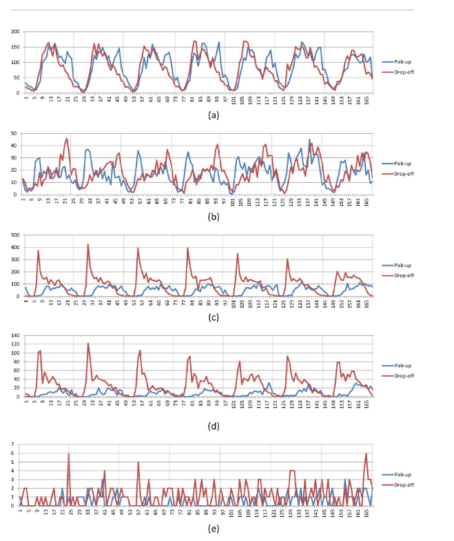
通过统计一个周期内5个区域上下车峰值的分布，可以联系实际对其作出解释并推测区域的功能和用地类型。
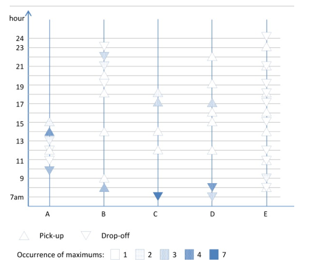

#### source-sink区域分类

对于每个格网区域，将其各时段上下车流量之差作为其上卸车平衡向量（DPBV），得到整个研究区域的上下车平衡矩阵（DPBM）。使用K均值方法对DPBV进行聚类，将格网区域分类。

### 案例分析

#### 数据

- 选取上海市7天出租车轨迹数据，划分为168个1h的时段
- 上海市35km*50km区域，划分为1750个1km*1km的歌王区域

#### 结果

通过对DPBV聚类将格网区域分为了5个source-sink类别：

- strong source-sink
- weak source-sink
- equilibrium
- weak source-sink
- moderate source-sink

之后又根据上下车点数量将平衡区域分为了高流量平衡区域和低流量平衡区域。
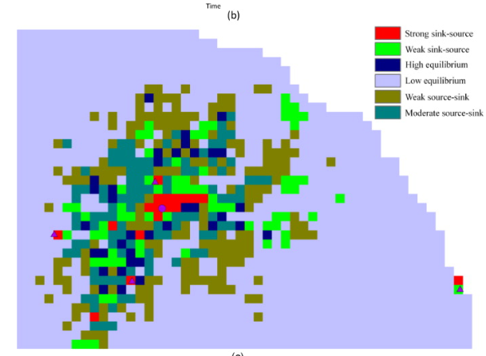
最后，通过对于不同用地类型流量特征的分析，文章分析了source-link类别与土地利用类型之间的关联。
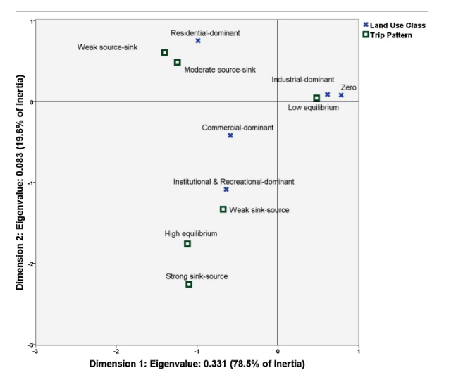

## 基于地块交互特征的土地利用类型分类

Paper: [Incorporating spatial interaction patterns in classifying and understanding urban land use](https://www.tandfonline.com/doi/abs/10.1080/13658816.2015.1086923)

### 原理

文章中认为具有相似的土地利用类型的地块在与其他地块的交互中存在着相似的交互模式，提取地块的交互特征（Interation Siginature）来进行聚类，达到土地利用分类的目的。

### 实现过程

#### IS提取

文中比较了三种提取地块节点交互特征的方式，并将其z-score正则化得到的特征矩阵结果用于之后的对比实验。

- Individual IS：地块与其他地块不同时段的交互流量（N*2T）
  
  由于地理局部性的存在，地块与相近的地块交互较多，导致相同用地类型的地块可能被分为不同类别，而相近的地块更容易被划分到同一类别，这种方法在原理上基本上等同于基于谱分析方法的社区发现算法。
- Aggregated IS：节点每小时的出度和入度构成的向量（1*2T）
  
  将所有流量同质化，忽略他们的起点/终点。
- Grouped IS：将流量按照来源/去向的地块的土地利用类型分组（K*2T）
  
  首先假定所有地块的用地类型已知，根据用地类型划分交互流量提取交互特征矩阵，通过迭代运算的方法得到稳定的用地类型划分。

  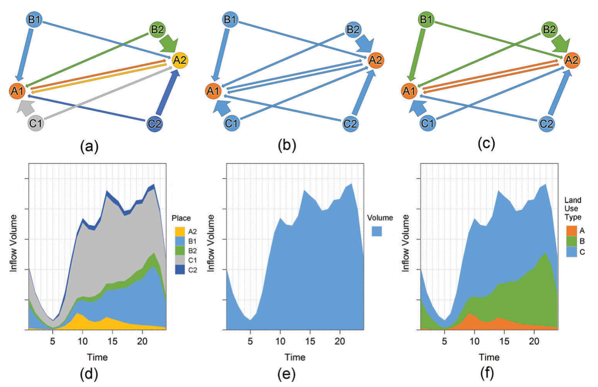

#### 用地类型推断

EM算法：首先根据已有信息猜测未知信息（E），根据这些猜测信息进行推断，对假设进行反思（M)，从而使猜测的正确率更高，最终得到一个可以解释整个数据的假设（可能是局部最优解）。

文章中首先随即将K中用地类型赋予每个地块节点，计算每个节点的Grouped IS，进行聚类得到K个分类，当地块节点用地类型变化的数量低于一定阈值时停止迭代。

### 案例分析

#### 数据

- 上海市周一至周四三周的出租车轨迹数据
- 划分24个时间段
- 500m*500m格网划分地块

#### 参数

- 使用K均值聚类，K设置为7
- EM算法迭代停止阈值设置为5%

#### 结果

通过对比谷歌地图的用地类型得到了七种用地类型：
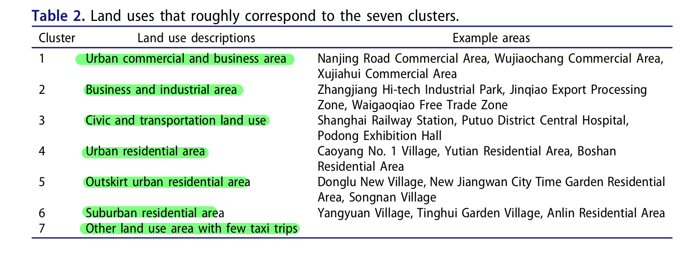
对比三种交互特征提取方式得到的分类结果中，个体交互特征的分类结果几乎等同于社区探测，聚合特征和分组特征的结果较为相似，对比发现分组特征的结果更为准确。
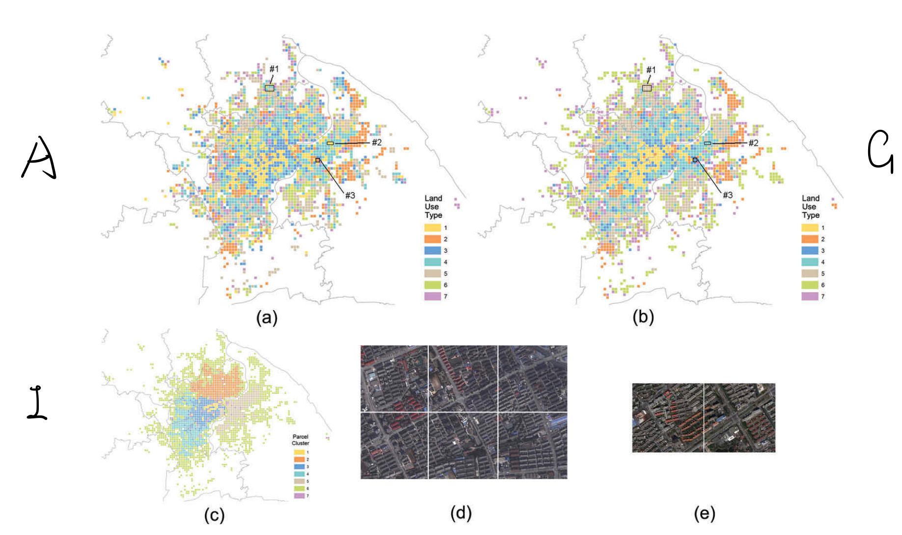
对于每一种用地类型取其地块交互均值得到了七种用地类型的交互时间特征曲线：
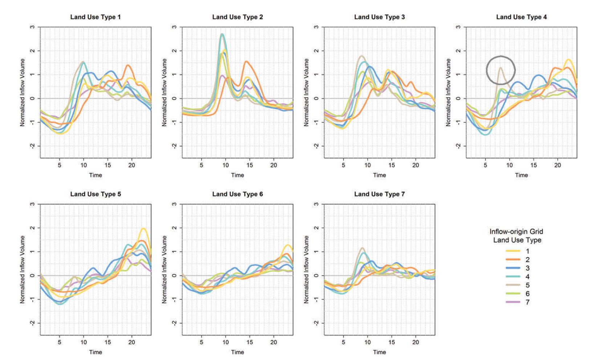
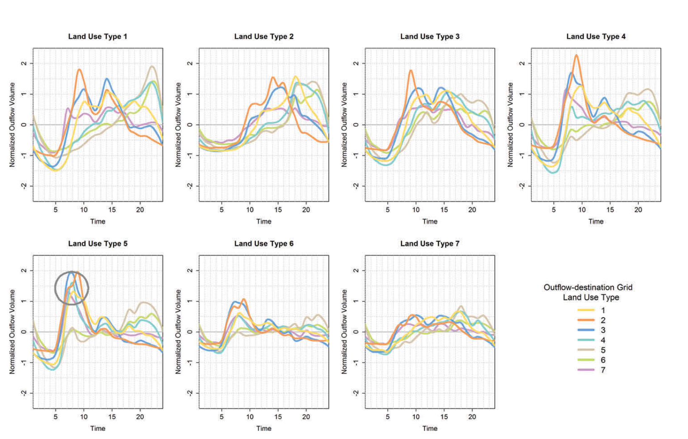

## 综合多种公共交通流量数据的子区分类

Paper: [Understanding the interplay between bus, metro, and cab ridership dynamics in Shenzhen, China](https://onlinelibrary.wiley.com/doi/abs/10.1111/tgis.12340)

### 原理

### 实现过程

#### 特征提取
对于选取的67个时间段，将每个空间分析子区的三种公共交通方式的各时间段流量所占比例作为子区的特征向量。

#### 相似度计算

- 基于自相关计算相似度：计算两个向量的自相关函数的距离来衡量相似度，这样的度量方式会受到SAU的大小和形状的影响。
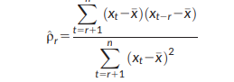
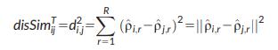
- 时空相似度：计算源节点与目的节点的邻接节点的自相关相似度并根据欧氏距离赋予权重综合得到源节点到目的节点的相似度；使用高斯径向基核函数映射至高维，去两个方向相似度均值作为最终两个节点的相似度。
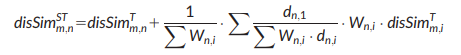
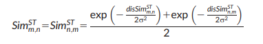
- 相似矩阵积分：将地铁，公交，出租车数据的相似度矩阵作为RGB，转换到YUV模型，将明度Y作为综合的相似度矩阵。

#### 聚类分析

使用谱分析的方式提取特征值，之后利用K-means聚类，使用Bartlett的方法求解k的最优值，最终得到5个聚类。

### 案例分析

#### 数据

- 在深圳市交通小区(TAZ)的基础上筛选与地铁服务缓冲区(MSB)相交的子区域，并将地铁站点分配和合并到子区，得到空间分析子区(SAZ)作为研究对象。
- 将15分钟作为建模的时间间隔，为了避免偏差，筛去了晚11：:5到早6：15公交地铁停运时间内的时间片段。
- 使用公交车，地铁和出租车数据：
  - 公交数据：来自812条线路的200万条上下车记录，具有明显的早晚高峰特征。
  - 地铁数据：来自100万个智能卡使用者的160万条地铁进出站数据，同样表现出早晚高峰特征，空间覆盖范围较小。
  - 出租车数据：记录了15000辆出租车的50万条轨迹数据，没有明显的早晚高峰，在公共交通非运营时间数量增长，空间分布呈现一定的聚类分布特征。
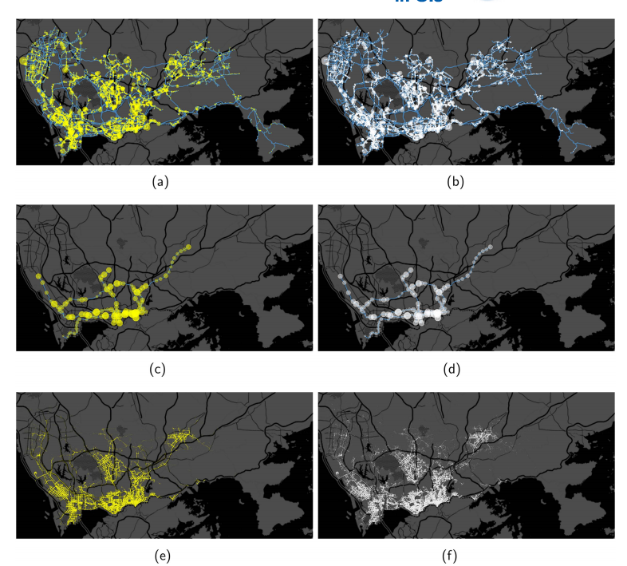

#### 结果

- cluster 1：地铁主导，出租车与地铁存在竞争；商业主导
- cluster 2：公交与地铁互补，出租车出行较少；高档住宅主导
- cluster 3：地铁存在明显的早晚高峰，公交出行较少，地铁与出租车存在一定竞争；住宅与工作平衡
- cluster 4：与2相似，但早高峰相对于晚高峰更为明显；住宅主导
- cluster 5：早高峰地铁主导，晚高峰公交主导；休闲主导
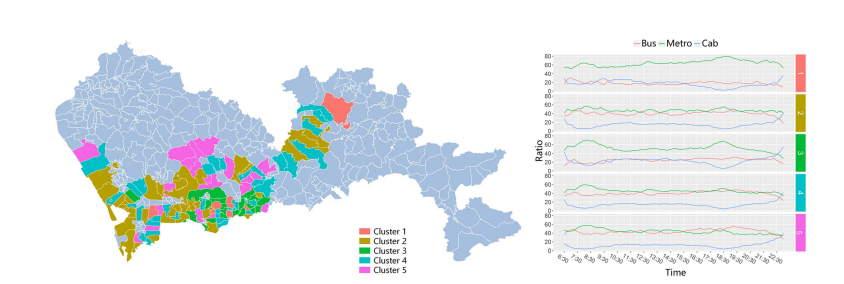

## 基于谱线分解的混合土地利用类型提取

Paper: [A framework for mixed-use decomposition based on temporal activity signatures extracted from big geo-data](https://www.tandfonline.com/doi/full/10.1080/17538947.2018.1556353)

### 原理

根据人类活动的规律性，文章中假设人群单一行为的时序活动特征具有稳定性并且能够反映城市区域的功能。在此基础上，根据出行数据提取时序活动特征绘制区域的功能曲线，利用聚类，观测等方法确定城市的基础活动曲线；使用线性分解的方式对各区域曲线进行分解，得到区域的混合功能分布特征，从而达到利用人群的时序活动特征模式来分析城市区域功能的目的。

### 实现过程

#### 时序活动特征提取

- 空间子区划分
- 时间间隔选取
- 数据归一化

#### 城市功能基础曲线提取

数据活动类型已知的情况下可以直接统计得到，活动类型未知的情况下采用以下几种方法：

- 聚类：将聚类中心作为基础功能曲线，功能类型需要人工标记
- 端成员提取：N-FINDER，SISAL
- 人工采样

#### 曲线分解

文章使用线性分解模型，可采用的其他方法包括神经网络，NMF等。

- 城市功能构成：根据曲线分解结果得到的城市基础功能曲线构成
- 动态活动比例：区域内每个时段下的各功能所占比例
- 混合指数：区域功能分布的熵，反映区域功能的混合程度

### 案例分析

#### 数据

- 32,000,000条工作日签到数据，包括ID，坐标，时间等信息
- 划分为24个时段

#### 结果

使用K均值（K=5），SISAL，遥感影像人工采样以及POI类型（外出活动，住宿和交通，餐饮，工作与教育，娱乐）四种方法得到了城市基础功能曲线：
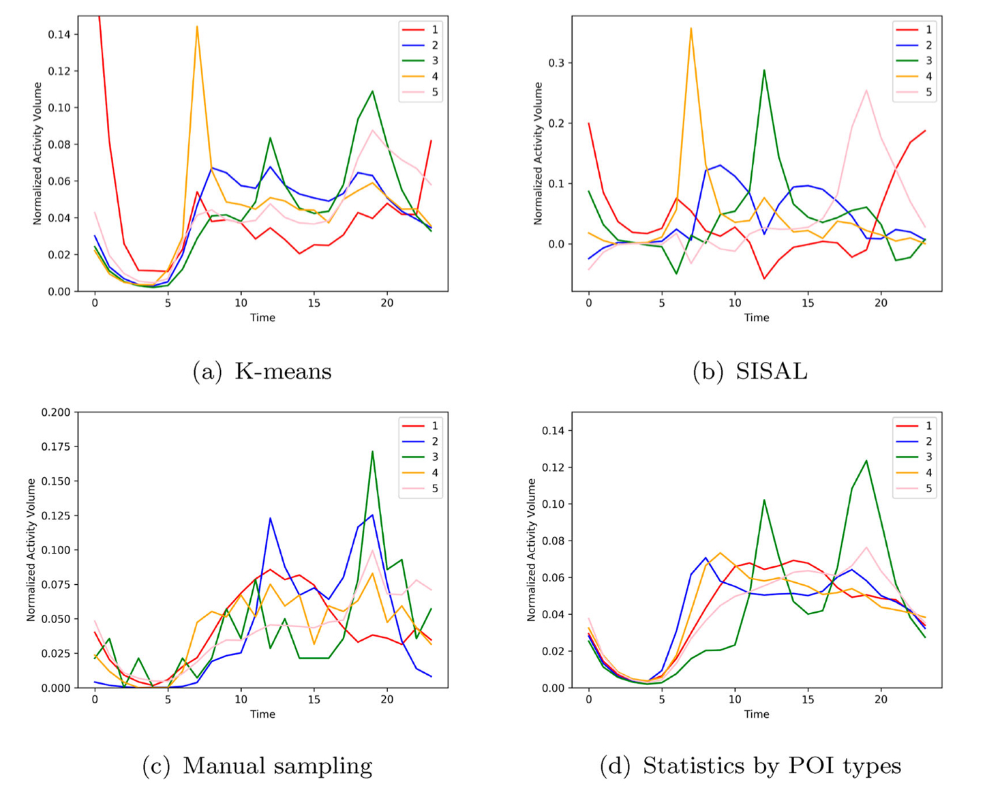
通过曲线分解得到了城市区域的混合功能分布特征：
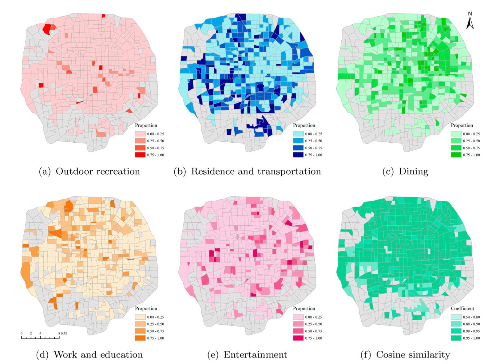
同时，可以利用动态活动比例对于一些地块进行更细致的分析,区域A和C模式较为相似，主要功能为居住以及教育和办公；而B区域具有较高的娱乐和餐饮功能比例。
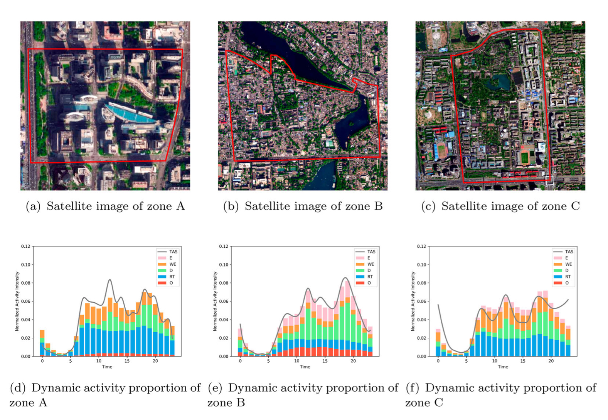

## 总结

共同点：

- 空间分割和时段分割
- 使用时序流量作为分析的特征向量
- 利用聚类的方法划分区域类型
- 得到的区域类型通过经验推断得到用地类型

不同点：

- 进出流量差异作为分析对象
- EM算法用地类型推断得到的分组交互特征
- 考虑空间以来的时空相似度计算和谱分析聚类过程
- 利用谱线分解得到区域混合功能的动态比例分布
