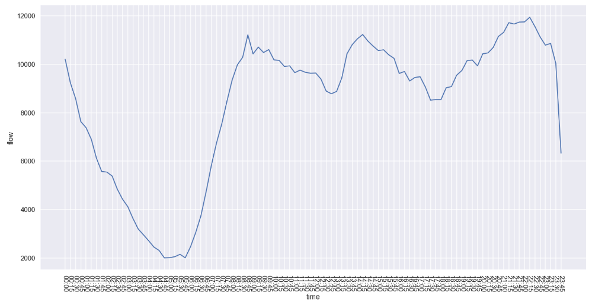
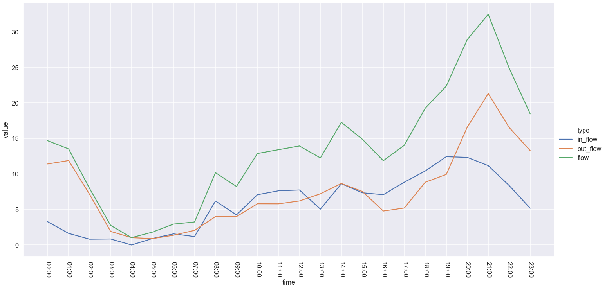
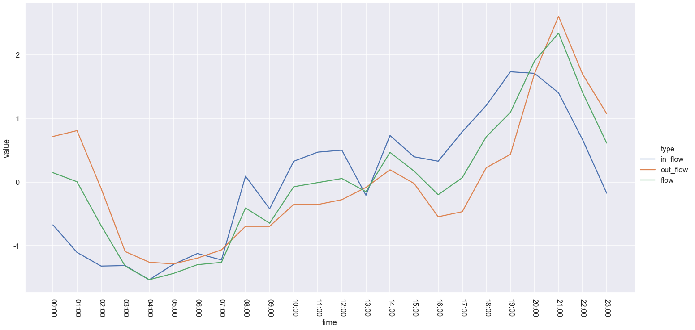
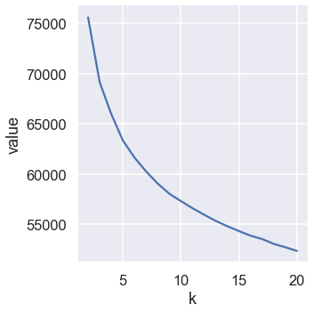
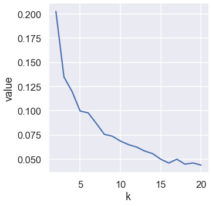

## 出租车区域活动曲线

### 区域总体曲线

曲线呈现出早、午、晚三个高峰：

## 区域活动曲线

由于数据量较小，15min间隔曲线不够平滑，故采用1h作为间隔

对流量曲线进行z-score标准化，得到标准化曲线：

## 聚类分析

根据活动曲线进行kmeans聚类，先通过sse曲线和边缘指数确定k取值：

使用ARI和AMI衡量聚类结果：

- ARI（adjusted rand index score）：通过真实结果中在同一类的个体是否在分类结果在处于同一类，以及真实结果中不在同一类的个体在分类结果在是否属于不同聚类作为判别指标。
- AMI（adjusted mutual info score）：利用两个分类结果的互信息熵作为衡量标准。

使用三种曲线作为特征进行聚类：

- flow（24）：ARI: 0.009722. AMI: 0.010850.
- in_out_flow（48）：ARI: 0.028705. AMI: 0.020436.
- source_link（in_flow - out_flow）：ARI: 0.017361. AMI: 0.018565.

ARI与AMI指数都是在RI和MI的基础上以随机聚类结果为目标进行调整，取值范围[-1, 1]，指数约高则两个分类的结果越契合，而0附近的指数值表明接近于随机聚类的结果。从结果观察发现，ARI和AMI指数均接近于0，直接利用活动曲线进行聚类得到的结果很难反映真实的用地分类情况。

## XGBoost分类

直接使用活动曲线进行分类训练（评价分数为merror）：

- flow：65%
- in out flow：63%
- source link：64%

## KNN分类

## 曲线特征

### 统计特征

- 中心位置
  - 均值
  - 中位数
  - 众数
- 发散程度
  - 全距（R）：max-min
  - 方差（VAR）
  - 标准差（STD）
  - 变异系数（CV）：std / mean
- 零值率：在标准化之前获得
- 波动率：90分位值-10分位值
- 偏度：衡量曲线的对称性
- 峰度：衡量曲线相对于正态分布的尖锐或平坦程度

### 时域特征

- 自相关系数：指时序序列于其自身在不同时间点的互相关性
- 偏自相关系数：提出中间k个变量之间的相互影响
- 差分：通过n阶差分曲线得到的统计量作为特征
- 季节和趋势特征：
  - 趋势性
  - 季节性
  - 周期性
  - 残差
- 时间序列的长期记忆性
  - 赫斯特指数
  - 趋势波动分析（DFA）
- 熵：量化随时间序列数据波动的规律性和不可预测性
  - 分桶熵
  - 近似熵
  - 样本熵

### 频域特征

- 傅里叶变换：取频域特征的统计特征作为特征值
- 小波变换：相对于傅里叶变换能够显示频谱出现的时间，利用时频曲线提取特征

## 参考资料

- https://blog.csdn.net/vegetable_bird_001/article/details/80653986
- https://blog.csdn.net/vegetable_bird_001/article/details/80662290
- https://blog.lazzy.site/2018/04/08/%E5%86%B3%E7%AD%96%E6%A0%91%E4%BD%BF%E7%94%A8%E6%80%BB%E7%BB%93/