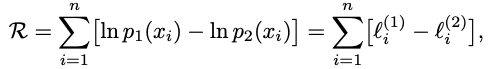

## Introduce
- 许多经验量都围绕一个典型值聚集。
- 并非所有的分布都符合这种模式，尽管仅出于这种原因通常不认为它们是有问题的或有缺陷的，它们不能像其他测量一样简单地被表征。
- 在本文中，我们解决了科学文献中一个反复出现的问题，即当我们看到幂律时如何识别幂律的问题。

## Definitions
连续随机变量的幂律分布满足：

由于x趋近于0时发散，因此x需要一个下界，在此基础上进行归一化得到：

同理，对于离散随机变量：

总结这些函数以及其他有用分布的基本函数形式和归一化常数：

## Fitting Power Laws to Empirical Data
介绍幂律分布的参数估计方法。

### Estimating the Scaling Parameter   
假设数据分布的下界已知，得到尺度参数的最大似然估计：

似然估计的标准差为：

对于离散型随机变量：

似然估计的标准差为：

虽然这一似然估计结果不存在闭合形式，但是其近似可以得到：

### Performance of Scaling Parameter Estimators
使用人工生成的幂律分布数据检验上一节中使用的最大似然估计的尺度参数的表现，
对比于基于线性回归的估计方法，MLE得出的估计值的误差精确度明显更高：

幂律分布的尺度参数的MLE估计只有在样本数量渐进正无穷时为无偏估计，在样本数量有限时，其偏差的衰减速度是O(1/n)，但相比于标准差的衰减速率快得多，因此大部分实际应用中不必考虑（通常，n>50是一个合理的样本数据量）。
### Estimating the Lower Bound on Power-Law Behavior
如上文所述，经验数据通常只有在x的下限值xmin之上时才完全遵循幂律分布，因此在计算尺度参数α的估计值之前，我们需要首先丢弃此点以下的所有样本，以便只剩下幂律模型对其有效的那些样本。
如图所示，当选择的xmin完全等于真实值时，MLE会给出准确的答案，但在此点以下会快速偏离（由于分布偏离幂定律），而在此点上则会缓慢偏离（由于样本数量减少）：

第一种方法是使用贝叶斯信息准则，使用一个模型对所有的数据进行建模，大于xmin的的数据使用标准的离散幂律分布表示，而对于小于xmin的数据，通过xmin-1个长度为1的区间的概率分布律表示，因此模型的参数个数为xmin，从而通过是贝叶斯信息最大化来计算最优的xmin取值：

在很多情况下，小于xmin部分的分布虽然不能够用标准幂律分布拟合，但是往往可以由一个参数更少的模型来确定。在这种情况下，BIC往往会低估xmin的值，这可能会导致随后计算出的缩放参数值出现偏差。
第二种方法的思想是，对于选择使得实际概率分布与最佳拟合幂律分布最为接近的xmin作为估计值。当xmin过大时，由于数据量的减少，统计波动会使效果变差；当xmin选择过小时，数据与幂律分布的拟合效果会下降。这一方法中使用KS统计信息（常用于衡量非正态分布的相似性）：

上式中的距离计算函数对于x很大时（概率接近于0）时不敏感，可以通过下面的方法重新确定权重来避免这一问题：

### Tests of Estimates for the Lower Bound
为了测试xmin参数估计的效果，生成了服从如下的分布函数的数据：

图a展示了不同的xmin拟合得到的幂律分布曲线，图b展示了两种方法估计得到的xmin与真实值分布之间的关系。

研究还发现，如果xmin以下的数据如果与幂律分布的偏离更大，则对于xmin的估计会更容易并且需要更少的观察数据。
为了表示估计结果的不确定性，通过对原始观测数据随机进行替换生成一个新的数据，在此基础上进行参数估计，多次重复此过程，利用这些结果的统计特征来反映原始估计量的不确定性。

## Testing the Power-Law Hypothesis
介绍如何定量的判断数据是否服从幂律分布。

单纯通过观察和幂律拟合的方法来验证假设很容易得出错误的结果：

基本方法是从真实的幂律分布中采样许多合成数据集，测量它们与幂律形式的波动程度，然后将结果与经验数据的相似度量进行比较。如果经验数据集与幂律形式的距离比典型的综合形式大得多，则幂律不是对数据的合理拟合。

首先，这种方法的有效性取决于我们如何测量分布之间的距离。；其次，当然，总是有可能再次由于采样波动而产生非幂定律过程，从而生成分布接近幂律的数据集，在这种情况下，我们的测试将失败。但是，随着n的增加，这种情况的几率降低，这就是为什么人们在尝试验证诸如此类的假设时偏爱大型统计样本的主要原因。

### Goodness-of-Fit Tests
回答假设检验问题的一种标准方法是使用拟合优度检验，该检验会生成一个p值，该值量化了假设的合理性。这里给出一个基于实际数据与假设模型分布间距离的检验方法：对于从同一模型得出的可比较的合成数据集，该距离与距离测量值进行了比较，并且p值定义为合成距离中大于经验距离的分数。如果p大（接近1），则经验数据和模型之间的差异可以仅归因于统计波动；反之，则不然。如果太小，则表明该模型与数据不符合。

首先，使用第3节的方法将经验数据拟合到幂律模型，并为此拟合计算KS统计量。接下来，我们生成大量幂律分布的合成数据集，其缩放参数α和下限xmin等于最适合观察数据的分布。我们将每个综合数据集分别拟合其自己的幂律模型，并针对每个相对于其自身模型求解KS统计量。然后，我们简单地计算所得统计量大于经验数据值的比例分数。这个分数是我们的p值。

在我们的计算中，我们做出了一个相对保守的选择：如果p≤0.1，则将幂律排除在外。就是说，排除了是否只有十分之一的可能性或更少，我们才偶然获得的数据与我们所拥有的数据在模型上的一致性差。

### Performance of the Goodness-of-Fit Test
为了演示这种方法的效用，并表明它可以正确地区分幂律与非幂律行为，以上图中的三个分布为例，可以发现，随着n的增大，这一指标对于幂律特征的区分能力越来越强。

但是，重要的是要注意，因为我们仅将幂律形式拟合到xmin以上的部分分布，所以fxmin有效地控制了我们必须处理的数据点的数量。如果xmin大，则只有一小部分数据集落在其上方，因此xmin的值越大，拒绝幂定律所需的n的总值就越大。这种现象在图5c中进行了描述，该图显示了对数正态分布和指数分布随xmin的变化需要越过p = 0.1f的阈值以下的n值。

## Alternative Distributions
即使我们的数据符合幂定律，也可能存在另一种分布，例如指数分布或对数正态分布，其拟合程度可能更好或更高。
### Direct Comparison of Models
使用似然比检验比较两种不同分布的拟合效果（其他的方法包括完全贝叶斯方法、交叉验证以及最小描述长度MDL等）。似然比检验背后的基本思想是计算两个竞争分布下数据的似然度。那么，可能性越高的越适合。或者，可以计算两个可能性的比率，或者等效地计算比率的对数R，取决于分布的优劣，该比率为正或负；如果出现平局，则为零。

当R接近于0时，统计波动的影响可能会决定R的正负，因此需要对其进行假设检验，通过p值的大小判断其是否具有统计意义。

现在假设我们担心对数似然比的真实期望值实际上为零，因此观察到的R的符号纯粹是波动的乘积，不能作为首选模型的指标而被信任。

## Nested Hypotheses
在某些情况下，比较的分布可能是嵌套的，这意味着一个分布家族是另一个分布家族的子集，如幂定律和指数截止的幂定律。嵌套出现时，通常会遇到较大的家族至少与较小的分布一样适合的情况，因为较小家族的每个成员也都是较大的成员。在这种情况下，需要进行稍微修改的似然比检验以正确地区分此类模型。

经过更细致的分析，正则化对数似然比在n的取值足够大时服从卡方分布。如果真实分布属于较小的族，则可以使用此结果来计算正确的p值，从而给出对数似然比取观测值或更差的概率，如果此p值较小，则可以排除较小的分布族。
## Performance of the Likelihood Ratio Test
使用幂律分布和对数正态分布进行测试，图中结果的灰色部分表示了似然比的一分位到三分位值的范围：
