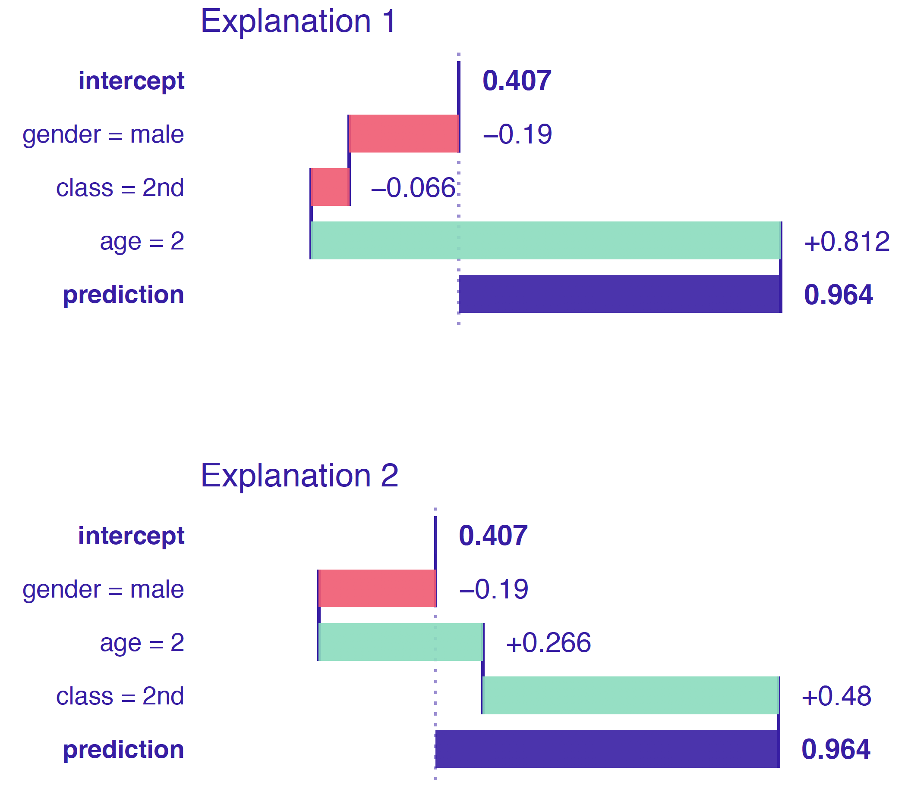
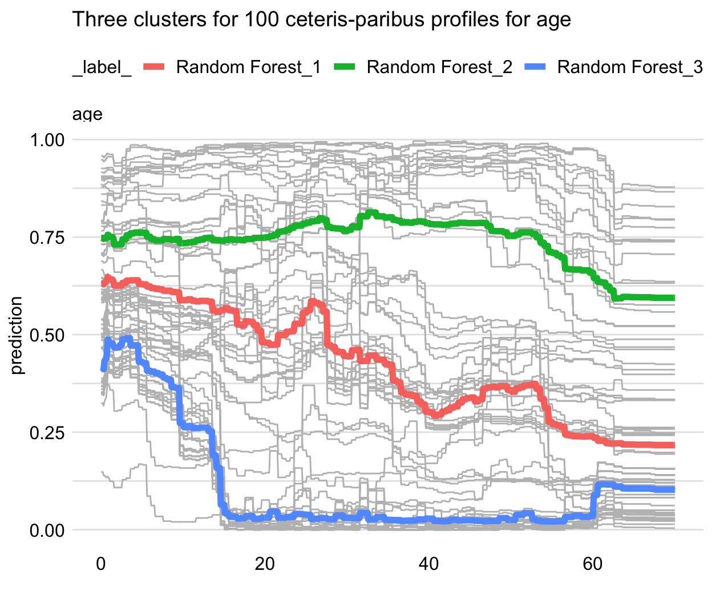
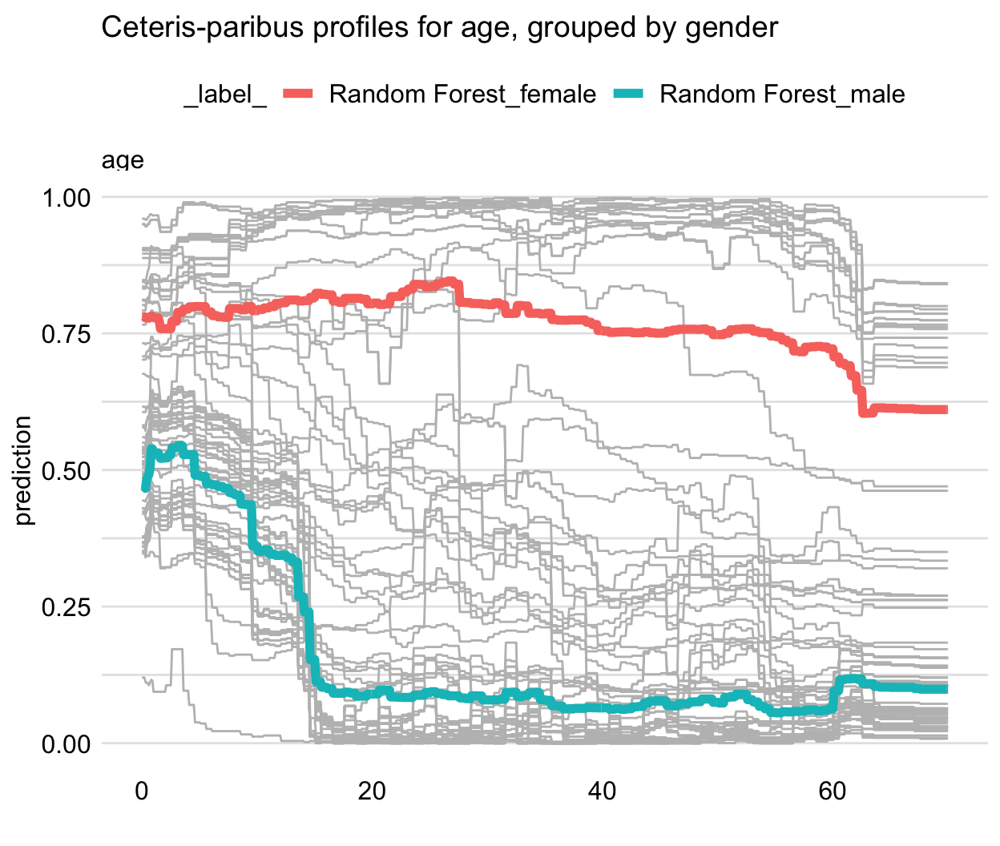

[原书地址](https://ema.drwhy.ai/)

## Introduction

书中指出，在1942年阿西莫夫在Runaround中制定了机器人的三条准则：
- a robot may not injure a human being.
- a robot must obey the orders given it by human beings.
- a robot must protect its own existence.
而现实中，与物理机器人相比，模型和算法对我们的生活影响更大，并且尽管有潜在危害的例子，但此类模型的应用仍不受管制。因此参考阿西莫夫的方法，提出了预测模型所必须满足的要求：
- Prediction’s validation. For every prediction of a model, one should be able to verify how strong the evidence is that supports the prediction.
- Prediction’s justification. For every prediction of a model, one should be able to understand which variables affect the prediction and to what extent.
- Prediction’s speculation. For every prediction of a model, one should be able to understand how the prediction would change if the values of the variables included in the model changed.
为了满足这些条件有两种方法：设计可解释模型（线性模型/基于规则的模型/带有少量参数的分类树），或者通过近似或简化设计模型无关的模型解释工具。

## Instance Level

书中将模型解释方法分为了实例级别与数据集级别分别进行讨论。实例级探索方法主要针对特定的单个观测值的预测结果进行解释，例如：
- 评估解释变量对于某个个体预测结果的影响
- 了解某些解释变量的值发生变化将如何影响模型的预测结果
- 分析模型不正确预测结果的原因
同时，作者将实例级探索方法分为了三类：
- 可变归因（variable attributions）：分析模型对特定实例的预测与平均预测有何不同，以及如何在解释变量之间分配这些差异。
- 使用模型的解释作为函数，并研究该函数在兴趣点（观察）周围的局部行为，对于不可知模型，需要通过简单的可知模型对其进行拟合。
- 研究如果单个解释变量的值发生变化，模型的预测将如何变化，即构建表示由单个解释变量的更改引起的模型预测变化曲线（CP profile）

### Break-down Plot for Additive Attributions

在可加性归因解释方法中，使用Break-down图来将模型预测分解为可归因与不同解释变量的贡献。

文中通过预测泰坦尼克号上一名乘客的生存概率进行举例说明：第一行显示了所有数据的模型预测的分布和平均值（红色点），当确定后续解释变量的值时，下一行显示预测的分布和平均值，最后一行显示了对特定兴趣实例的预测，C中的绿色和红色条分别表示平均预测的正和负变化（归因于解释变量的贡献）。

而图中所展示的模型解释方法只是对于解释变量加入顺序中一种的分析，更改解释变量的加入顺序，BD图给出的解释将发生变化：

BD方法所使用的实现更完备的可加性归因解释的方法是将解释变量作为随机变量，求解变更解释变量值过程中归因于解释变量的贡献（预测值变化）的期望。该方法具有简洁易懂、计算量小的有点，但是必须建立在解释变量间相互独立的基础上，并且解释变量的引入顺序会很大程度上影响解释结果（一种解决方法是每次分别计算重要性指标，并将重要性最高的变量放在开头）。

### Shapley Additive Explanations (SHAP) for Average Attributions

解决解释变量的排序问题的一种更好的方法是计算不同排序方式下，解释变量贡献的平均值，这一方法由合作博弈论中提出的Shapley值得出。对于shapley值的有效估计算法SHAP已经被广泛应用于各类模型解释之中。

使用25种不同的随机排序解释对上文中出现的例子就可以得到如下的结果，SHAP便是基于这一原理之上的高效估计算法：

Shapley值提供了一种统一的方法，可以将模型的预测分解为贡献，这些贡献可以累加地归因于不同的解释变量。shapley值的问题在于，其提供了解释变量针对于模型的累加贡献，如果模型不是可加的，则Shapley可能会产生误导（？）。

> An important drawback of Shapley values is that they provide additive contributions (attributions) of explanatory variables. If the model is not additive, then the Shapley values may be misleading. This issue can be seen as arising from the fact that, in cooperative games, the goal is to distribute the payoff among payers. However, in the predictive modelling context, we want to understand how do the players affect the payoff? Thus, we are not limited to independent payoff-splits for players.

### Local Interpretable Model-agnostic Explanations (LIME)

加性模型解释方法更适用于中低数量特征的模型解释，而对于含有大量解释变量的模型时，由于可加性模型通常会赋予变量非零的贡献度，因此效果不够理想。对于稀疏解释器最著名的方法是不可知模型局部解释（LIME），其核心思想在于通过已知的可解释模型对黑盒模型进行局部近似。图中解释了LIME方法的原理，两个颜色表示黑盒模型所形成的二分类器，而对于加号表示的解释目标点，首先人工引入数据点（目标点周围的点，点大小表示与目标点的距离），之后根据引入的数据点利用简单的白盒模型进行拟合（如线性回归模型）来近似黑盒模型在目标点附近的局部解释。

具体来讲，对于黑盒模型$f()$和兴趣点$\underline{x_*}$，LIME方法可以表示为：

$$\hat g = \arg \min_{g \in \mathcal{G}} L\{f, g, \nu(\underline{x}_*)\} + \Omega (g)$$

$\nu(\underline{x}_*)$表示兴趣点的相邻点，$L()$损失函数用于度量两个分布之间的差异，最后引入正则化修正来限制近似模型的复杂度。然而在这一过程中值得注意的一点是，原始模型与近似模型的输入变量所属的数据空间并不一致，原始解释变量可能包含大量的特征，而近似模型可以定义一个转换方式$h()$使输入维度远小于原始解释变量的维度。因此实现LIME的步骤主要包含三部分：

- 解释变量的表示：对于图像输入，可以采用超像素的方法（图像分割）；对于文本输入，可以使用词语集；对于连续值可以进行离散分割；对于类别值可以进行组合等。
- 围绕兴趣点的采样：对于二进制输入，可以进行简单的随机转换；对于连续输入则可以采用引入高斯噪声/离散化等方法。
- 拟合白盒模型：白盒模型一般选择简单的线性回归模型（LASSO等）。

对于前文的泰坦尼克号幸存预测例子，使用LIME方法，通过K-LASSO（K=3）进行解释，可以得到如下的结果：

LIME方法能够对无假设黑河模型进行解释，并且在局部保证高准确性，同时它能够将原始数据空间转换为更具解释性的低维空间，在图像/文本模型解释领域得到非常广泛的应用。但是对于其他类型的数据，如何进行解释变量的转换通常会影响解释的结果，这一问题尚未解决。而另一方面，使用白盒模型对黑盒模型进行拟合，近似质量也不总是在模型的每个位置都能够得到保证。

### Ceteris-paribus Profiles

前两种方法都是针对单个实例解释变量预测结果的解释，将预测分解为可归因于特定变量的成分。而Ceteris-paribus通过假设其他变量的值均不发生变化来了解目标变量值的变化如何影响模型的预测结果，即求解预测分布对于单个变量的条件期望。

本质上，CP图显示了因变量的条件期望（响应）对特定解释变量值的依赖性，同样以泰坦尼克号乘客生还预测为例，针对某一47岁第一阶层的乘客绘制cp图进行研究可以得到如下的结果，CP曲线所反映的结果更利于满足上文中提出规则的第三点，即推测解释变量发生变化所带来的预测值响应。

CP图方法会为每一个解释变量生成一个曲线，当变量维度很高时，很难在其中寻找出真正具有意义的变量，因此在CP图的基础上又提出了CP抖动方法用于衡量解释变量的重要性（类似于前两种方法所得到的变量重要性归因值）。实现方法是求解CP曲线的绝对值积分值，即CP图曲线下面积和：

$$vip_{CP}^j(\underline{x}_*) = \int_{\mathcal R} |h^{j}_{\underline{x}_*}(z) - f(\underline{x}_*)| g^j(z)dz=E_{X^j}\left\{|h^{j}_{\underline{x}_*}(X^j) - f(\underline{x}_*)|\right\}$$

CP图易于比较，因为可以通过覆盖两个或多个模型的CP图，以更好地了解模型之间的差异。还可以比较两个或多个实例，以更好地了解模型预测的稳定性，其也是进行敏感性分析的有用工具。但CP图最大的问题在于无法考虑变量之间的互相关作用，从而产生误导性结果，因为互相关的变量在根本上违反了一个发生变化而另一个不变的假设；另一方面，基于条形图的CP图针对一些数量较多的离散变量类型时难以处理。CP抖动方法也具有CP图所具有的局限性，同时它也不满足前两种方法具有的局部精确性和公理完整性（归因值只和等于预测值变化）。

### Local-diagnostics Plots

局部诊断图通过观察与兴趣点实例相似实例的表现来检查模型的局部表现，书中介绍了局部保真度和局部稳定性两种诊断策略。

局部保真度图用于围绕兴趣点的观察评估模型的局部预测性能。将数据集中与兴趣点相似的观察点记为兴趣点的邻近点，局部保真度的原理是比较兴趣点邻近点和整个测试集的残差（真实值与预测值之差）分布的差异。保真度对于检查感兴趣实例的模型拟合是否无偏很有用，因为在这种情况下，残差应该很小，并且它们的分布应该在0附近对称。

局部稳定性度量的是一些解释变量的微小变化是否会显著影响预测结果，即比较兴趣点邻近点之间模型解释结果的差异，图中以泰坦尼克号幸存预测为例画出了兴趣点周围10个邻近点的年龄变量CP剖面曲线，从图中可以断定模型的预测在兴趣点周围是稳定的。

### Summary

总的来说，对于书中的实例，首先使用不同的几种变量归因方法进行解释，结果一致表明，从预测约翰生存概率的角度来看，最重要的解释变量是年龄，性别，阶级和票价，但是，由于票价和舱位相关，并且年龄和性别的影响之间可能存在相互作用，因此加性分解提供的图像可能并不完全正确。接着，通过CP剖面图画出这四个特征的CP曲线可以进一步分析更改解释变量将对预测结果造成的影响。而第三行对于四个变量的分布特征进行了展示，可以帮助进一步了解兴趣点的特征与整体数据特征的关系。

不同模型解释技术通常取决于数据数据和研究的问题：
- 模型中的解释变量数量：变量数量很少时使用CP图最能反映每个变量的具体作用机理；变量数量较大时使用SHAP或BD方法可以快速获得变量的影响力；当变量数量非常大且不具有单独的实际意义时，使用LIME进行简化更为合理。
- 解释变量之间的相关性：相互作用归因/二维CP图等。
- 模型的交互作用：在具有交互作用的模型中，一个解释变量的作用可能取决于其他变量的值。
- 解释的稀疏性：预测模型可以使用数百个解释变量来生成特定实例的预测，但是其中可能只有少数变量具有实际的解释意义，使用LIME可以解决这一问题，但是需要合理的变量转换方法。

## Dataset Level

相比于基于个体实例的模型解释，数据集级别的模型解释可以提供以下信息：
- 模型中解释变量的重要性，发现重要解释变量或删除无关变量来简化模型
- 了解目标变量如何影响模型的整体预测（例如公寓位置如何导致价格的变化）
- 发现是否存在一些观测值导致模型产生错误的预测
- 研究模型的整体“性能”，例如，比较两个模型的预测平均准确性

### Model-performance Measures

书中首先介绍了用于模型整体性能评估的度量方法，这种评估分为两大类：对拟合优度的评估（GoF）和对预测准确性的评估（GoP）。GoF与以下问题有关：模型的预测在多大程度上解释（拟合）了用于开发模型的观测值的因变量值？另一方面，GoP与以下问题有关：该模型对新观测值的因变量值预测得如何？通常来说对于某些度量，它们对GoF或GoP的解释取决于它们是通过使用训练数据还是测试数据来计算的。

对于解释变量的$n$个观察结果$\underline{X}=(x_1',...,x_n')$和因变量$\underline{y}=(y_1,...,y_n)'$，训练集被用于训练模型$f(\hat{\underline{\theta}};\underline{X})$，文章根据因变量的不同性质分别介绍了各种模型评价度量指标。

#### 连续因变量

GoF：均方误差（MSE）：
$$MSE(f,\underline{X},\underline{y}) = \frac{1}{n} \sum_{i}^{n} (\widehat{y}_i - y_i)^2 = \frac{1}{n} \sum_{i}^{n} r_i^2$$

MSE的构建与因变量的尺度相关。因此，此度量的一个更可解释的变体是均方根误差（RSME）：
$$RMSE(f, \underline{X}, \underline{y}) = \sqrt{MSE(f, \underline{X}, \underline{y})}$$

由于MSE对异常值的敏感度，有时会使用中值绝对偏差（MAD），MAD相比于MSE具有更强的对异常值鲁棒性，但是其数学性质较差：
$$MAD(f, \underline{X} ,\underline{y}) = median( |r_1|, ..., |r_n| )$$

GoP：对于测试集，采用MSE的计算方法可以计算预测均方误差（MSPE）和均方根误差（RMSPE）；在没有测试数据的情况下，连续因变量模型的最著名的GoP度量之一是预测平方和（PRESS）：
$$PRESS(f,\underline{X},\underline{y}) = \sum_{i=1}^{n} (\widehat{y}_{i(-i)} - y_i)^2$$
从PRESS中又可以衍生出预测平方误差（PSE）和标准差（SEP）以及另一个常见的标准：
$$Q^2(f,\underline{X},\underline{y}) = 1- \frac{ PRESS(f,\underline{X},\underline{y})}{\sum_{i=1}^{n} ({y}_{i} - \bar{y})^2}$$

#### 二值因变量

GoF：将MSE/RSME/MAD运用到二值因变量中也可以得到相应的评价指标，其中MSE对应Brier分数：
$$\sum_{i=1}^{n} \{y_i(1-\widehat{y}_i)^2+(1-y_i)(\widehat{y}_i)^2\}/n$$

基于MSE的指标在二值因变量模型中的问题在于其对于错误预测的惩罚力度太小，为了解决这一问题可以采用基于伯努利分布的对数似然函数（对数损失函数/交叉熵）：
$$l(f, \underline{X},\underline{y}) =  \sum_{i=1}^{n} \{y_i \ln(\widehat{y}_i)+ (1-y_i)\ln(1-\widehat{y}_i)\}$$

GoP：预测错误的后果取决于错误的形式。因此，更经常使用基于正确/错误预测的概率（的估计值）的性能度量。而为了将模型得出的连续输出转为二值输出，通常需要通过阈值C进行截断，从而得到预测结果的混淆矩阵。

在TP的重要性大于TN时，准确性具有意义，而当样本不平衡时，准确性不能提供足够的信息：

$$ACC_C = \frac{TP_C+TN_C}{n}.$$

当一类错误（FP）的代价很高时，精准度更为实用：

$$Precision_C = \frac{TP_C}{TP_C+FP_C} = \frac{TP_C}{P_C}.$$

相对的，召回率用于惩罚二类错误（FN）：

$$Recall_C = \frac{TP_C}{TP_C+FN_C} = \frac{TP_C}{S}.$$

F1分数则是在二者之间寻求平衡：

$$F1\ score_C = \frac{2}{\frac{1}{Precision_C} + \frac{1}{Recall_C}} = 2\cdot\frac{Precision_C \cdot Recall_C}{Precision_C + Recall_C}.$$

为了评估结果对于C值选取的依赖程度，常见的方法是绘制ROC曲线（Receiver Operating Characteristic）表示敏感性和特异性的反比关系，对于随机预测模型，该曲线为对角线，而对于理想模型，曲线将为一条水平线。因此可以通过曲线下面积（AUC）来进行衡量，对于随机模型aoc=0.5，而对于理想模型aoc=1。

基于与空模型（随机模型）进行比较的理念，可以计算gini因子$G=2*AOC-1$，而基于同样的理念，也有人提出了lift：

$$Lift_C  = \frac{\frac{TP_C}{P_C}}{\frac{S}{n}} = n\frac{Precision_C}{S}.$$

#### 分类因变量

对于分类因变量，因变量的真实值表示为$y_i^k(k=1,\dot,K)$，其中只有一个值为1而其他值为0，预测模型的输出值则为一个表示输出结果属于各类别概率k维的向量。

GoF：可以将对数似然函数推广到多类别变量中：

$$l(f, \underline{X} ,\underline{y}) =  \sum_{i=1}^{n}\sum_{k=1}^{K} y_{i}^k \ln({\widehat{y}}_i^k).$$

GoP：同样的，将二分类问题推广到多分类问题中只需要将多分类问题看作是多个二分类问题来分别计算其混淆矩阵，而如何把多个二分类问题的性能进行汇总则存在不同的方法，机器学习中将这两种方法分别成为宏观（macro）平均和微观（micro）平均：

$$\overline{ACC_C} = \frac{1}{K}\sum_{k=1}^K\frac{TP_{C,k}+TN_{C,k}}{n}.$$

$$\overline{Precision_C}_{\mu} = \frac{\sum_{k=1}^K TP_{C,k}}{\sum_{k=1}^K (TP_{C,k}+FP_{C,k})}.$$

### Variable-importance Measures

本节介绍的变量重要性度量方法来自于论文：Fisher A, Rudin C, Dominici F. All Models are Wrong, but Many are Useful: Learning a Variable's Importance by Studying an Entire Class of Prediction Models Simultaneously[J]. Journal of Machine Learning Research, 2019, 20(177): 1-81.其核心思想在于衡量如果去除选定的解释变量的影响，模型的性能会发生怎样相应的变化。

具体来说，对于模型输入$\underline{X}$，模型输出$\hat{\underline{y}}$，真实值$y$以及模型损失函数$\mathcal L(\underline{\hat{y}}, \underline X, \underline{y})$，对于目标解释变量$j$重要性的计算步骤包括：
- 计算原始数据的损失函数的值$L^0 = \mathcal L(\underline{\hat{y}}, \underline X, \underline{y})$
- 通过重新排列j行解释变量来创建$\underline{X}^{*j}$，并基于其计算模型预测值$\underline{\hat{y}}^{*j}$
- 计算模型预测结果的损失函数$L^{*j} = \mathcal L(\underline{\hat{y}}^{*j}, \underline{X}^{*j}, \underline{y}).$
- 通过$L^{*j} = \mathcal L(\underline{\hat{y}}^{*j}, \underline{X}^{*j}, \underline{y}).$或$vip_{Ratio}^j = L^{*j} / L^0$评估变量的重要性

需要注意的部分在于，评估结果可能很大程度上取决于重新排列中的随机性，因此需要重复多次来减少这种不确定性。同时这种方法也可以用于比较不同模型中同一个解释变量的重要性。

### Partial-dependence Profiles

PD剖面图的基本思想是显示模型预测的期望值如何根据解释变量的改变而发生变化，而这种方法实际上相当于对于多个针对单个实例解释的CP剖面曲线取均值得到的结果。对于加性模型，CP曲线是平行的，因此，均值将保留形状，同时提供更精确的估计。但是，对于例如包含交互的模型，CP配置文件可能不是并行的。在那种情况下，平均值可能不一定与任何特定轮廓的形状相对应，不过，它仍然可以提供有关模型预测如何依赖于给定解释变量的变化的信息。

模型$f()$对于解释变量$X^j$的PD剖面曲线表示如下：

$$g_{PD}^{j}(z) = E_{\underline{X}^{-j}}\{f(X^{j|=z})\}.$$

但通常情况下$X^j$的分布是未知的，因此实际使用中通过训练数据集中的经验分布来进行计算：

$$\hat g_{PD}^{j}(z) =  \frac{1}{n} \sum_{i=1}^{n} f(\underline{x}_i^{j|=z}).$$

然而如上文提到，CP曲线如果是平行的，则平均值可以很好的概括整体信息，但是如果他们不平行则效果不够理想，这种情况下可以采用对CP曲线进行聚类分析进行进一步探索，得到聚类PD剖面图。上文例子中得到的结果显示：它们可以分为三类：一组用于年龄在18岁以下的预计生存概率大幅下降的乘客（平均值由蓝线表示），一种在整个年龄范围内的概率几乎呈线性下降（红线代表平均值），另一种具有几乎恒定的预测概率（绿线代表平均值）。

进一步的，可以通过其他解释变量对实例进行分组来进一步探索，当模型包含两个变量之间的相互作用时，这种方法可以发现明显的规律。举例来说，特定性别的平均数具有不同的形状：与男性相比，女性在不同年龄段的预测生存概率更加稳定。因此，分组PD剖面图清楚地表明了年龄和性别之间的相互作用。

### Local-dependence and Accumulated-local Profiles

PD曲线来源于CP曲线的期望，因此其具有与CP曲线相同的问题，即变量之间存在相关性时会产生误导的结果（原因在于一些不符合事实的变量实例的产生），因此本节介绍了解决此问题的局部累计剖面图和与其相关的局部依赖剖面图。简单来说，以$X^1,X^2$两个解释变量为例，PD曲线的问题在于研究$X^1$变量对模型预测的影响时，直接使用了$X^2$的边缘分布（原本的经验分布），但如果二者存在相关性，这种边缘分布将不符合实际意义；因此LD曲线（Local-dependence profile）使用给定$X^1$的条件分布来解决这一问题，然而这并没有根本上解决问题，因为这相当于将模型中剩余的变量边缘化，而这些变量中也可能存在与$X^1$的相关性，因此局部依赖效应和累积局部（AL）曲线被提出。

#### Local dependence profile

LD曲线定义为：

$$g_{LD}^{f, j}(z) = E_{\underline{X}^{-j}|X^j=z}\left\{f\left(\underline{X}^{j|=z}\right)\right\}$$

实际应用中，LD曲线可以通过下面的方法进行估计，$N_j$表示$X^j$接近于$z$的观察结果的集合，以此来估计$\underline{X}^{-j}|X^j=z$的条件分布：

$$\hat g_{LD}^{j}(z) = \frac{1}{|N_j|} \sum_{k\in N_j} f\left(\underline{x}_k^{j| = z}\right)$$

为了得到连续的估计值，也可以通过如下的方式进行加权估计，$w_i(z)$表示$z,x_i^j$之间的距离（类似于LIME中的采样方法，因此称为局部依赖），可以通过高斯核函数$w_i(z) = \phi(z - x_i^j, 0, s)$等方法计算这一距离。

$$\tilde g_{LD}^{j}(z) = \frac{1}{\sum_k w_{k}(z)} \sum_{i = 1}^n w_i(z) f\left(\underline{x}_i^{j| = z}\right)$$

如果解释性变量与某些其他变量相关联，则该变量的LD曲线将捕获所有变量的影响。例如对于模型$y=X^1+X^2$，其中如果有相关性$X^1=X^2$，则计算LD曲线则会得到实际两倍的结果：

$$g_{LD}^{1}(z) = E_{X^2|X^1=z}(z+X^2) = z + E_{X^2|X^1=z}(X^2) = 2z$$

#### Accumulated local profile

为了解决这一问题，AL（Accumulated-local）曲线定义为：

$$g_{AL}^{j}(z) = \int_{z_0}^z \left[E_{\underline{X}^{-j}|X^j=v}\left\{ q^j(\underline{X}^{j|=v}) \right\}\right] dv + c$$

$$q^j(\underline{u})=\left\{ \frac{\partial f(\underline{x})}{\partial x^j} \right\}_{\underline{x}=\underline{u}}$$

AL曲线的定义核心思想在于取CP曲线在$v$处的变化率在条件分布$\underline{X}^{-j}|X^j$上的期望，并在接近有效分配支持下限$z_0$到$z$之间积分。局部梯度的平均可以避免出现在PD和LD profile中的问题，即捕获加性模型中特定变量profile中其他变量的影响（无交互作用）。以上文中的双变量线性模型为例：

$$g_{AL}^{1}(z) = \int_{z_0}^z \left\{E_{{X}^{2}|X^1=v}(1)\right\} dv + z_0 = z.$$

在实际使用中通过离散求和代替积分并通过偏差代替求导来进行估计（同样可以利用距离函数计算平滑估计）：

$$\widehat{g}_{AL}^{j}(z) = \sum_{k=1}^{k_j(z)} \frac{1}{n_j(k)} \sum_{i: x_i^j \in N_j(k)} \left\{ f\left(\underline{x}_i^{j| = z_k^j}\right) - f\left(\underline{x}_i^{j| = z_{k-1}^j}\right) \right\} - \hat{c}$$

$$\widetilde{g}_{AL}^{j}(z) = \sum_{k=1}^K \left[ \frac{1}{\sum_{l} w_l(z_k)} \sum_{i=1}^N w_{i}(z_k) \left\{f\left(\underline{x}_i^{j| = z_k}\right) - f\left(\underline{x}_i^{j| = z_k - \Delta}\right)\right\}\right] - \hat{c}$$

#### Example

实例模型$f(X^1, X^2) = (X^1 + 1)\cdot X^2$，$X^1=X^2$，该模型变量之间相关，且存在交互（不可加），现有8次观测结果如下：

在具有相互作用的预测模型中，如何定义解释变量$X^1$的影响是非常主观的，下面给出了PD/LD/AL曲线在这一模型中的表现。首先计算实例CP曲线：

$$h^{1}_{CP}(z) = f(z,X^2) = (z+1)\cdot X^2$$

根据CP曲线取均值，得到PD曲线，PD曲线显示的解释变量影响力为常值0：

$$\hat g_{PD}^{1}(z) =  \frac{1}{8} \sum_{i=1}^{8} (z+1)\cdot X^2_{i} = \frac{z+1}{8}  \sum_{i=1}^{8} X^2_{i} = 0$$

使用条件分布代替边缘分布可以得到LD曲线，通过两个观察值进行估计，可以得到图中的结果，LD分布图显示了条件分布中预测变化的平均值：

$$g_{LD}^{1}(z) =  z \cdot (z+1)$$

同样利用两个观测值进行估计可以得到AL曲线：

$$g_{AL}^{1}(z) = \int_{-1}^z E \left[\frac{\partial f(X^1, X^2)}{\partial X^1} | X^1 = v \right] dv  = \int_{-1}^z E \left[X^2 | X^1 = v \right] dv = \int_{-1}^z v dv = (z^2 - 1)/2$$

三种曲线显示了模型的不同方面，使我们获得了对于$X^1$影响力的三种不同解释。三种曲线都是对于CP曲线的不同方式的汇总方法，当解释变量是独立的并且模型中没有相互作用时，CP曲线是平行的，并且它们的均值可以对它们进行充分的总结。当模型是可加的但解释性变量与其他一些变量相关时，PD和LD曲线都无法正确捕捉解释变量对模型预测的影响，但是AL曲线可以做到这一点。当模型中存在交互时，没有任何曲线将提供对交互中涉及的任何解释变量的影响的正确评估（实际上大部分实际模型都属于这种类型）。当存在交互作用时，可以通过对两个或多个因变量使用PD曲线的连接来探索它们。

